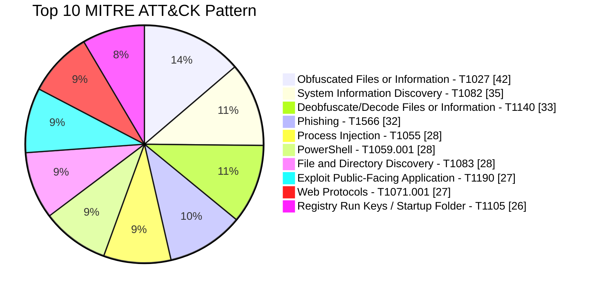
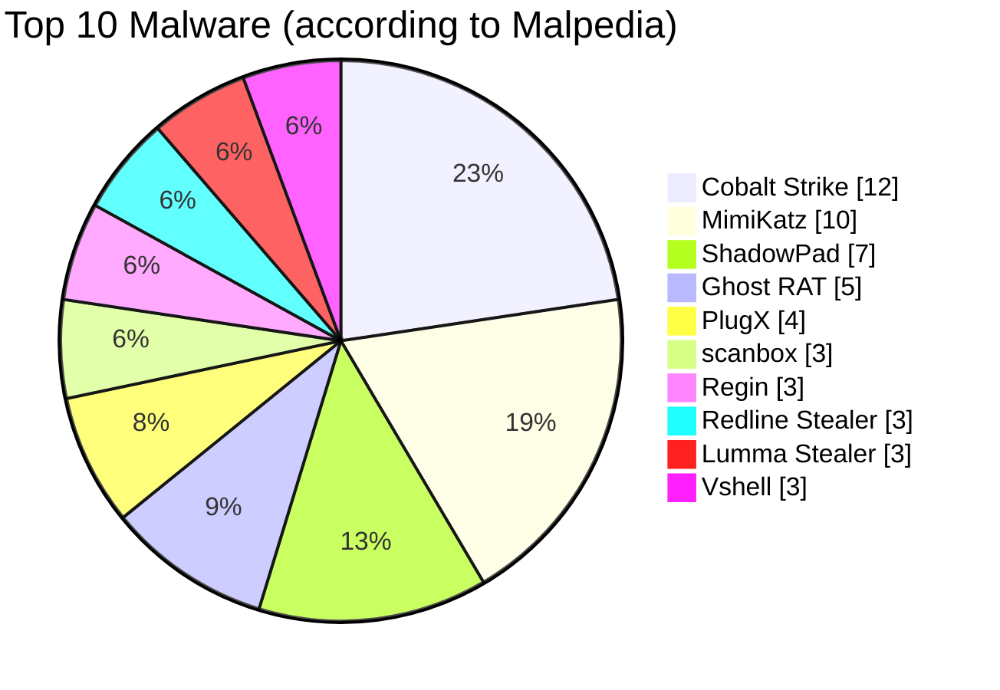

# Latest MITRE ATT&CK Heatmap targeting Malaysia (source: Rectifyq MISP-MY)

# Top 10 MITRE ATT&CK Pattern

```mermaid
    pie showData
    title Top 10 MITRE ATT&CK Pattern
    "Obfuscated Files or Information - T1027":	42
    "System Information Discovery - T1082":	35
    "Deobfuscate/Decode Files or Information - T1140":	33
    "Phishing - T1566":	32
    "Process Injection - T1055":	28
    "PowerShell - T1059.001":	28
    "File and Directory Discovery - T1083":	28
    "Exploit Public-Facing Application - T1190":	27
    "Web Protocols - T1071.001":	27
    "Registry Run Keys / Startup Folder - T1105":	26
```

# Top 10 Malware (according to Malpedia)

```mermaid
    pie showData
    title Top 10 Malware (according to Malpedia)
        "Cobalt Strike":	12
        "MimiKatz":	10
        "ShadowPad":	7
        "Ghost RAT":	5
        "PlugX":	4
        "scanbox":	3
        "Regin":	3
        "Redline Stealer":	3
        "Lumma Stealer":	3
        "Vshell":	3

```

