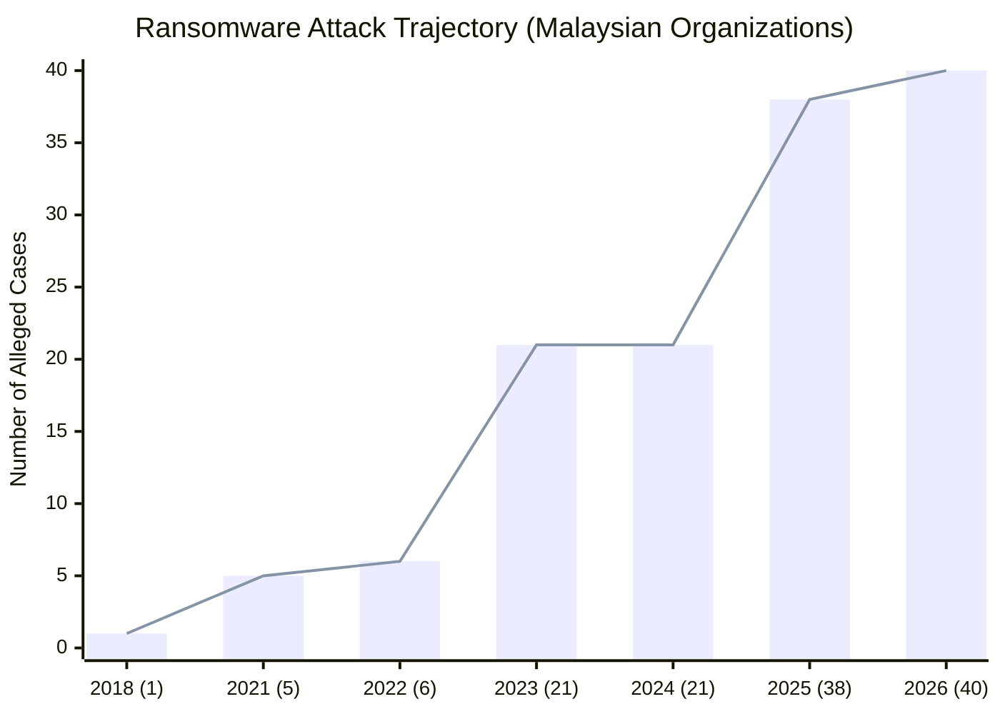
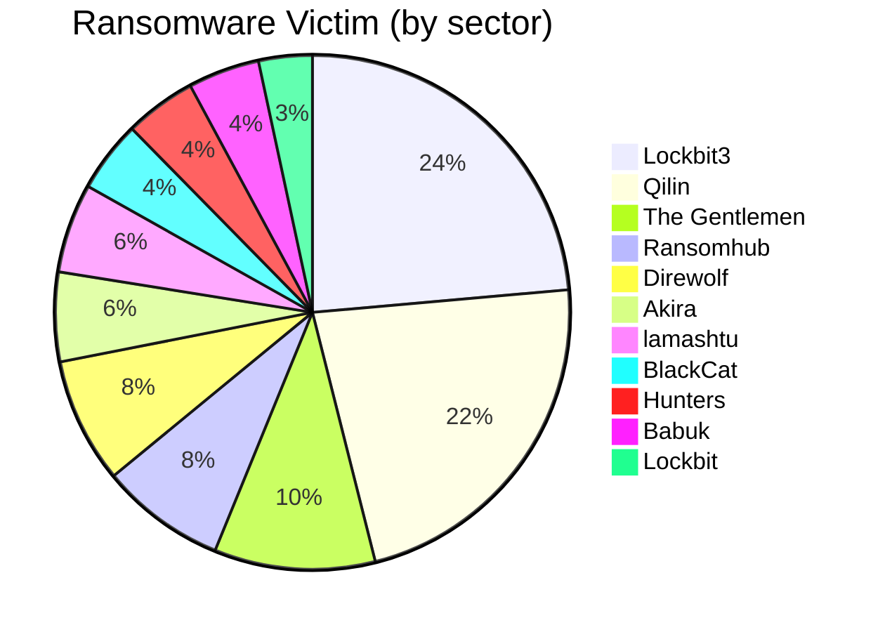
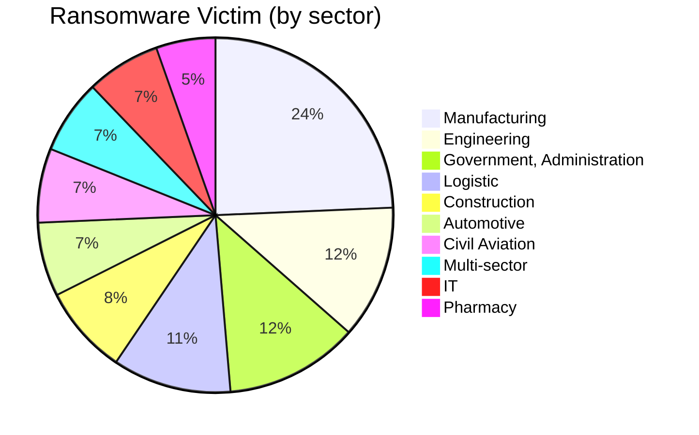

# Ransomware Tracker

## Ransomware Attack Trajectory (Malaysian Organizations) - Up to July 2026 

## Timeline of MY organizations in alleged Ransomware cases

```mermaid
timeline
    2018 (1) : Med** Pri** Ber*** (Television Broadcast)
    2021 (5) : GDe****** Ber*** (Logistic)
         : Mer********* Asi* Sdn Bhd (Payment)
         : Jab**** Per******** Ban*** dan Des* Neg*** Sel***** (Government, Administration)
         : TLP Ter***** Sdn Bhd (Logistic)
         : UM* Hol***** Ber*** (Multi-sector)
    2022 (6) : Asi* Pac**** Uni******* Sdn* Bhd* (Academia - University)
         : Sho******* Sdn Bhd (Marketing)
         : UCS* Edu****** Sdn* Bhd* (Academia - University)
         : Aut**** Hir***** Saf*** Sdn Bhd (Automotive)
         : Age*** Pek****** Mel***** Sdn Bhd (Employment)
         : Air**** Gro** (Civil Aviation)
    2023 (21) : Mat*** Edu**** Sdn Bhd* (Education)
         : ViT*** Cor******** Ber*** (Electronic)
         : Kil*** Ti* Ca* Se** Sdn Bhd (Manufacturing)
         : Sun**** Pha*********** Sdn Bhd (Pharmacy)
         : TF AM* Mic************* (Electronic)
         : Age*** Kau******* dan Pen******* Kre*** (Government, Administration)
         : Fia*** Hol***** Ber*** (Multi-sector)
         : Isk***** Reg***** Dev******** Aut****** (Government, Administration)
         : Hon* Kon* Sa Sa (M) Sdn***** (Online marketplace)
         : Lei* Hin* Gro** Ka** San*** Mal****** (Logistic)
         : Asi* Pac**** Uni******* Sdn* Bhd* (Academia - University)
         : Pla********** (M) Sdn Bhd* (Manufacturing)
         : Pen**** Sol***** Sdn* Bhd* (IT)
         : Pra****** Mal***** Ber*** (Transport)
         : Waw**** Den**** Sdn Bhd (Construction)
         : May*** Man********** (M) Sdn Bhd (Manufacturing)
         : Ala* Flo** Sdn Bhd (Environment)
         : Nat***** Ant*********** Cri** Cen*** NF*** (Government, Administration)
         : Ind** Wat** Kon******* Sdn Bhd (Environment)
         : Ken** Cor******** (M) Sdn Bhd (Agriculture)
         : Tra******* Int********** Ins****** Bro**** Sdn Bhd (Insurance)
    2024 (21) : Har****** Hol***** Ber*** (Manufacturing)
         : HOE Pha************ Sdn Bhd (Pharmacy)
         : IJM Cor******** Ber*** (Multi-sector)
         : Fre***** Int********** Sdn* Bhd* (Manufacturing)
         : Rek*** Sdn* Bhd* (Technology)
         : Kov** Sdn Bhd (eCommerce)
         : Mal****** Ind******* Dev******** Fin**** Ber*** MI*** (Finance)
         : MH* Dis********* Sdn Bhd (Retail)
         : CAR***** HES* Ope****** Com**** Sdn Bhd (Oil and Gas)
         : iCa***** Lim**** (Automotive)
         : Pra****** Mal***** Ber*** (Transport)
         : Ban* Ker****** Rak*** Mal***** Ber*** (Bank)
         : REX**** PC Sdn Bhd (Retail)
         : Duo****** Bio**** Ber*** (Pharmacy)
         : FG* Hol***** Ber*** (Agriculture)
         : CAR*** Est*** Sdn Bhd (Pharmacy)
         : Phe** Uni* Tru*** Ber*** (Investment)
         : Sou***** Aci** (M) Ber*** (Chemical)
         : Del** Hol***** (M) Sdn Bhd (Security systems)
         : MI* Ind******* Sdn Bhd (Engineering)
         : Maj*** Aga** Isl** Mel*** (Government, Administration)
    2025 (38)  : Mal**** Air**** Sdn Bhd* (Civil Aviation)
         : Kov** Sdn Bhd (eCommerce)
         : Rek*** Sdn* Bhd* (Technology)
         : CAR* CO* MY Sdn* Bhd* (IT)
         : Tho** Si* Sdn Bhd (Retail)
         : Ran**** Ber****** Sdn Bhd (Engineering)
         : Aeo****** Int******** Sdn Bhd (Game)
         : Swi** Hau**** Ber*** (Logistic)
         : Rai**** As**** Cor******** (Railway)
         : Maj*** Per******** Amp*** Jay* (Government, Administration)
         : Mal***** Air***** Hol***** Ber*** (Civil Aviation)
         : Naz* TTD* Sdn Bhd (Automotive)
         : TF AM* Mic************* (Electronic)
         : MS Sup*** Cha** Sol****** Ma******* Sdn Bhd (Logistic)
         : Agr***** Hol***** Sdn Bhd (Agriculture)
         : Dew** Ban****** Kua** Lum*** (Government, Administration)
         : MS* Met** Ind******* Sdn Bhd (Manufacturing)
         : Eve******* Cor******** Ber*** (Engineering)
         : War**** TC Hol***** Ber*** (Multi-sector)
         : Ta* Cho** Mot** Hol***** Ber*** (Automotive)
         : Cus*** Foo* Ing******** Sdn Bhd (Food)
         : HC* Cap**** Gro**(Development)
         : Pal***** Man******* Sdn Bhd (Investment)
         : EAS* Des*** Arc****** Sdn* Bhd (Consulting)
         : SF* Tec******* (M) Sdn Bhd (Electric)
         : Reg**** Spe******* Hos***** (Health)
         : Mei****** Ma******* Sdn Bhd (Engineering)
         : Fed**** Aut* Hol***** Ber*** (Automotive)
         : Sil******* Axi* Ltd Gro** (IT)
         : CyP*** Res****** Ber*** (Energy)
         : Hei**** Pad* Ber*** (IT)
         : YP* Ma******* Sdn Bhd (Manufacturing)
         : XO* Com Sdn Bhd (Telecoms)
         : MFE* For***** Tec******* Sdn Bhd (Construction)
         : Sou***** Lio* Sdn* Bhd* (Manufacturing)
         : PJS* Con******** Sdn Bhd (Consulting)
         : Ori***** Cas*** Sdn Bhd (Manufacturing)
         : Ber**** Air Sdn* Bhd* (Civil Aviation)
    2026 (40) : Sun*** Gro** Ber*** (Manufacturing)
         : Bin* Dar****** Ber*** (Construction)
         : PTS Gol***** Ind******* Sdn Bhd (Manufacturing)
         : RED**** Dig**** Ber*** (Telecoms)
         : Che***** Kon******* Sdn Bhd (Engineering)
         : Per**** Petr***** Ber*** (Oil and Gas)
         : WRP Asi* Pac**** Sdn Bhd (Manufacturing)
         : Kon**** Nas***** Ber*** (Logistic)
         : PLU* Mal***** Ber*** (Infrastructure)
         : WCT Hol***** Ber*** (Construction)
         : Mal***** Air***** (Civil Aviation)
         : Gol*** Cla* Ind******* Sdn Bhd (Manufacturing)
         : Ker**** Pro**** Gro** (Construction)
         : Int********** Ass******* Sdn (Health)
         : fav************* (Manufacturing)
         : Jat* Tin*** (Engineering)
         : Jes** Gro** (Development)
         : Mal****** NP* Fer******* Sdn* Bhd (Agriculture)
         : olp********* (Engineering)
         : whe*********** (Manufacturing)
         : Mal****** NPK Fer******* Sdn* Bhd (Agriculture)
         : fav************* (Manufacturing)
         : Jes** Gro** (Development)
         : Int********** Ass******* Sdn (Health)
         : Ker**** Pro**** Gro** (Construction)
         : Int************ (+ Tsk************** + Ame******************** + Woo*************) (Manufacturing)
         : PNS* Ins****** Bro**** Sdn Bhd (Finance)
         : Maj*** Per******** Alo* Gaj** (Government, Administration)
         : MS* Gro** (Logistic)
         : Sha******** Met*** (Manufacturing)
         : M* I* Par***** Sdn Bhd (IT)
         : S** Malaysia (Engineering)
         : TH* PRO**** MAN******* SDN* BHD* (Engineering)
         : Ked** Sta** Gov******* (Government, Administration)
         : Vil*** Hot** in Att*** Hot*** and Res**** (Hotels)
         : UiT* Hol***** (Investment)
         : Ma** Ho** Fur******* Sd* Bh* (Retail)
         : Qua***** Log****** Sdn Bhd (Logistics)
         : Pus** Reh********* PER**** (Health)
         : Sun*** Ber*** (Multi-sector)
```

p.s. This is based on Ransomware Group claims or news, unless the organization confirmed it then it is only a claim.

## Top 10 Ransomware Group impacting Malaysian Organziations

## Top 10 sectors affected by Ransomware

> [!ABSTRACT]- Click to expand Full breakdown Ransomware victim by sector:
> ## Full breakdown Ransomware victim by sector:
> | Sector | Count |
> | -- | -- |
> | Manufacturing | 18 |
> | Engineering | 9 |
> | Government, Administration | 9 |
> | Logistic | 8 |
> | Construction | 6 |
> | Automotive | 5 |
> | Civil Aviation | 5 |
> | Agriculture | 5 |
> | Multi-sector | 5 |
> | IT | 5|
> | Pharmacy | 4 |
> | Retail | 4 |
> | Health | 4 |
> | Electronic | 3 |
> | Academia - University | 3 |
> | Development | 3 |
> | Investment | 3 |
> | Technology | 2 |
> | Telecoms | 2 |
> | Oil and Gas | 2 |
> | Environment | 2 |
> | eCommerce | 2 |
> | Consulting | 2 |
> | Transport | 2 |
> | Finance | 2 |
> | Bank | 1 |
> | Railway | 1 |
> | Online marketplace | 1 |
> | Television Broadcast | 1 |
> | Marketing | 1 |
> | Energy | 1 |
> | Insurance | 1 |
> | Employment | 1 |
> | Chemical | 1 |
> | Payment | 1 |
> | Security systems | 1 |
> | Electric | 1 |
> | Food | 1 |
> | Education | 1 |
> | Game | 1 |
> | Infrastructure | 1 |
> | Hotels | 1 |
