> [!abstract] Disclaimer: The Attribution Nuance
> Actor clustering and naming are interpretations by specific researchers or vendors. For most organizations, prioritizing generic detection of **TTPs (Tactics, Techniques, and Procedures)** offers higher defensive value than definitive attribution. Formal attribution is primarily the domain of Law Enforcement and Government entities with the authority to pursue legal or physical recourse.\
> \
> **TL;DR:** Attribution is subjective. Focus on detecting TTPs to protect your network; leave identifying the "who" to Law Enforcement.

```mermaid
flowchart LR
    M["🇲🇾 Malaysia"] --o C["🇨🇳 China"]
    M --o I["🇮🇱 Israel"]
    M --o U["🇺🇸 USA"]
    M --o N["🇰🇵 North Korea"]
    M --o R["🇷🇺 Russia"]
    M --o I1["🇮🇩 Indonesia"]
    M --o I2["🇮🇳 India"]
    M --o I3["🇮🇷 Iran"]
    M --o K["🇰🇷 South Korea"]
    M --o U1["Uncategorized"]

    R --> A1[APT28]
    R --> A2[APT29]
    I2 --> A3[RAZOR-TIGER]
    I2 --> A4[QUILTED-TIGER]
    I2 --> A5[HAZY-TIGER]
    I3 --> A6[Fox-Kitten]
    C --> A7[UNC3886]
    C --> A8[APT15]
    C --> A9[APT23]
    C --> A10[APT30]
    C --> A11[APT40]
    C --> A12[APT41]
    C --> A13[Earth-Estries]
    C --> A14[Earth-Lusca]
    C --> A15[RedJuliett]
    C --> A16[RedDelta]
    C --> A17[HAFNIUM]
    C --> A18[GALLIUM]
    C --> A19[Platinum]
    C --> A20[Hellsing]
    C --> A21[Naikon]
    C --> A22[LOTUS-PANDA]
    C --> A23[GOBLIN-PANDA]
    C --> A24[Evasive-Panda]
    C --> A25[Aoqin-Dragon]
    C --> A26[TA428]
    C --> A27[Worok]
    C --> A28[Earth-Longzhi]
    U1 --> A29[SOLAR-SPIDER]
    U1 --> A30[ToddyCat]
    U1 --> A31[LabHost]
    U1 --> A32[ScamClub]
    U1 --> A33[El-Machete]
    U1 --> A34[Orangeworm]
    U1 --> A35[Cobalt]
    U1 --> A36[Thrip]
    U1 --> A37[Roaming-Mantis]
    N --> A38[Lazarus-Group]
    K --> A39[DarkHotel]
    U --> A40[Equation-Group]
    I1 --> A41[INDOHAXSEC-TEAM]

    click A1 "/tags/APT28" _blank
    click A2 "/tags/APT29" _blank
    click A3 "/tags/RAZOR-TIGER" _blank
    click A4 "/tags/QUILTED-TIGER" _blank
    click A5 "/tags/HAZY-TIGER" _blank
    click A6 "/tags/Fox-Kitten" _blank
    click A7 "/tags/UNC3886" _blank
    click A8 "/tags/APT15" _blank
    click A9 "/tags/APT23" _blank
    click A10 "/tags/APT30" _blank
    click A11 "/tags/APT40" _blank
    click A12 "/tags/APT41" _blank
    click A13 "/tags/Earth-Estries" _blank
    click A14 "/tags/Earth-Lusca" _blank
    click A15 "/tags/RedJuliett" _blank
    click A16 "/tags/RedDelta" _blank
    click A17 "/tags/HAFNIUM" _blank
    click A18 "/tags/GALLIUM" _blank
    click A19 "/tags/Platinum" _blank
    click A20 "/tags/Hellsing" _blank
    click A21 "/tags/Naikon" _blank
    click A22 "/tags/LOTUS-PANDA" _blank
    click A23 "/tags/GOBLIN-PANDA" _blank
    click A24 "/tags/Evasive-Panda" _blank
    click A25 "/tags/Aoqin-Dragon" _blank
    click A26 "/tags/TA428" _blank
    click A27 "/tags/Worok" _blank
    click A28 "/tags/Earth-Longzhi" _blank
    click A29 "/tags/SOLAR-SPIDER" _blank
    click A30 "/tags/ToddyCat" _blank
    click A31 "/tags/LabHost" _blank
    click A32 "/tags/ScamClub" _blank
    click A33 "/tags/El-Machete" _blank
    click A34 "/tags/Orangeworm" _blank
    click A35 "/tags/Cobalt" _blank
    click A36 "/tags/Thrip" _blank
    click A37 "/tags/Roaming-Mantis" _blank
    click A38 "/tags/Lazarus-Group" _blank
    click A39 "/tags/DarkHotel" _blank
    click A40 "/tags/Equation-Group" _blank
    click A41 "/tags/INDOHAXSEC-TEAM" _blank

```

# List of Related Threat Actors
- #APT15
- #APT23
- #APT28
- #APT29 
- #APT30
- #APT37
- #APT40
- #Aoqin-Dragon
- #Cobalt
- #DarkHotel
- #Earth-Estries
- #Earth-Longzhi
- #Earth-Lusca
- #El-Machete
- #Equation-Group
- #Evasive-Panda
- #Evil-Corp
- #Fox-Kitten
- #GALLIUM
- #GOBLIN-PANDA
- #HAFNIUM
- #HAZY-TIGER
- #Hellsing
- #INDOHAXSEC-TEAM
- #Kimsuky
- #LOTUS-PANDA
- #LabHost
- #Lazarus-Group
- #Naikon
- #Operation-C-Major
- #Orangeworm
- #PLATINUM
- #QUILTED-TIGER
- #RAZOR-TIGER
- #RedDelta
- #RedJuliett
- #Roaming-Mantis
- #Rupert-Group
- #R00TK1T
- #SOLAR-SPIDER
- #ScamClub
- #Sowbug
- #TA428
- #Thrip
- #Thrip
- #ToddyCat
- #UNC3886
- #Worok