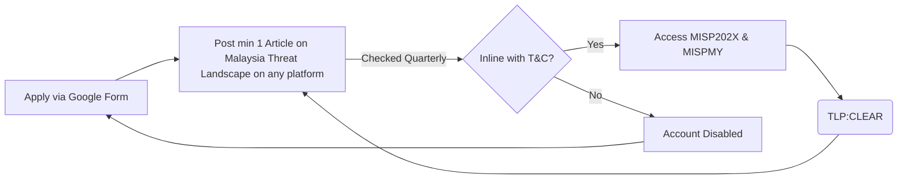
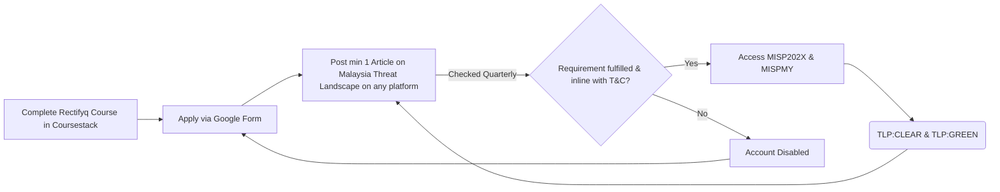
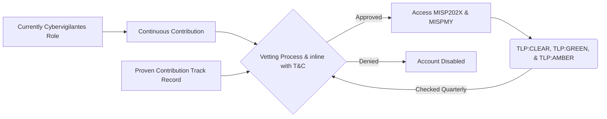

Application to get access to Rectifyq's TIP (MISP) is now open.
https://forms.gle/b57aaQixjdS5CPTEA

Courses to be released soon.🙏

## Roles Comparison
| Feature | Lvl1:Cybervigilantes | Lvl2:Cybervigilantes | Lvl3:Cyberheroes |
| --- | --- | --- | --- |  
|Access Rights|Read-only|Publisher|Vetted User|
|Data Scope|TLP:CLEAR & TLP:GREEN|TLP:CLEAR & TLP:GREEN|All (inc. TLP:AMBER)|
|Data Masking|Masked data|Masked data|Unmasked data|
|Primary Action|Observation & Learning|Reporting & Publishing|Deep Analysis & Vetting|
|Yearly KPI|None|Completed course + Publish at least 1 original articles on local threats.|Publish at least 4 original articles on local threats, Vetted/well known national contribution or sponsored for the project|

## Role: Lvl1:Cybervigilantes 

## Role: Lvl2:Cybervigilantes

## Role: Lvl3:Cyberheroes
