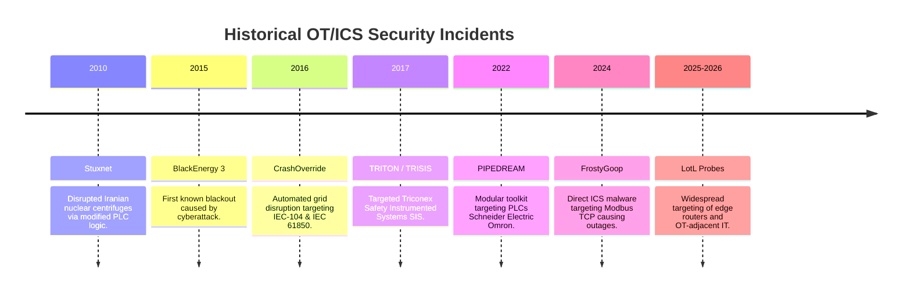
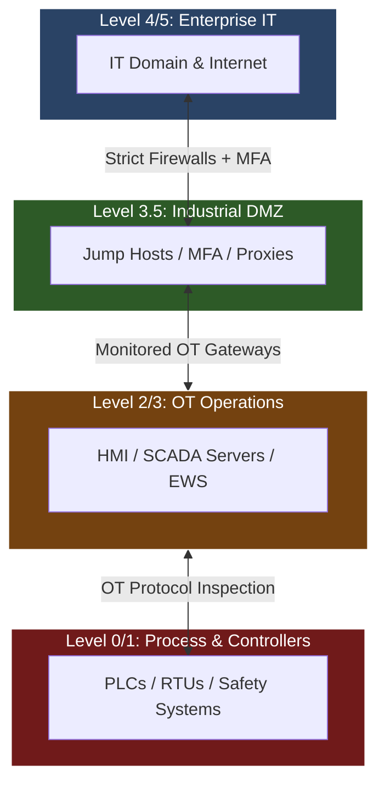

> [!CAUTION] **Current Threat Status: ELEVATED**
> State-sponsored threat actors and extortion groups are actively prioritizing living-off-the-land (LotL) tactics, engineering workstation compromises, and targeting safety instrumented systems (SIS) across energy, water, and critical manufacturing sectors.

---

## 1. Executive Summary

Operational Technology (OT) and Industrial Control Systems (ICS) have shifted from targets of opportunity to primary objectives for strategic disruption, espionage, and extortion. Adversaries are migrating down the **Purdue Model**, leveraging IT/OT convergence zones to pivot from corporate networks into Level 2 (HMI/SCADA) and Level 1 (PLC/RTU) environments.

---

## 2. MITRE ATT&CK® for ICS Heatmap

The diagram below highlights high-frequency techniques used across modern OT/ICS intrusions. Node colors represent the **observed adversary activity level**:

```mermaid
graph LR
    subgraph InitialAccess ["1. Initial Access"]
        T0886["T0886: Remote Services"]:::critical
        T0822["T0822: External Services"]:::medium
        T0865["T0865: Spearphishing"]:::medium
    end

    subgraph Execution ["2. Execution & Pivot"]
        T0807["T0807: Command-Line"]:::medium
        T0887["T0887: Eng Workstation"]:::high
        T0858["T0858: Change Mode"]:::medium
    end

    subgraph Persistence ["3. Persistence & Evasion"]
        T0859["T0859: Valid Accounts"]:::critical
        T0888["T0888: Living off Land"]:::high
        T0839["T0839: Module Firmware"]:::medium
    end

    subgraph Impact ["4. ICS Impact"]
        T0826["T0826: Loss of Control"]:::critical
        T0836["T0836: Modify Parameter"]:::high
        T0880["T0880: Loss of Safety"]:::critical
    end

    InitialAccess --> Execution
    Execution --> Persistence
    Persistence --> Impact

    classDef critical fill:#ff4d4d,stroke:#333,stroke-width:2px,color:#fff
    classDef high fill:#ffa64d,stroke:#333,stroke-width:1px,color:#000
    classDef medium fill:#e6e600,stroke:#333,stroke-width:1px,color:#000
```

* Critical Focus (Red): Frequent real-world exploitation / Direct impact capability.
* High Activity (Orange): Primary pivot & lateral movement vectors.
* Medium Activity (Yellow): Pre-attack reconnaissance and execution steps.

---

## 3. OT/ICS Incident Timeline

Major historical and recent OT/ICS cyber incidents showcasing the evolution from targeted malware to framework-driven operational disruption.

---

## 4. Active OT Threat Actors

| Threat Group | Aliases / Attribution | Primary Target Sectors | Key Capabilities & Tooling | Threat Level |
| :--- | :--- | :--- | :--- | :--- |
| **VOLTZITE** | Volt Typhoon (PRC) | Energy, Water, Communications, Transportation | Living-off-the-Land (LotL), SOHO router botnets, credential harvesting | **Critical** |
| **ELECTRUM** | Sandworm / Unit 74455 (GRU) | Electrical Grids, Energy, Government | Industroyer, Industroyer2, HermeticWiper, CaddyWiper | **Critical** |
| **XENOTIME** | TEMP.Veles | Oil & Gas, Petrochemical, Energy | TRITON / TRISIS malware, Safety System manipulation | **Critical** |
| **CHERNOVITE** | Unknown (State-sponsored) | Cross-sector ICS/SCADA systems | PIPEDREAM / INCONTROLLER attack framework | **High** |
| **BERSERK BEAR** | Dragonfly 2.0, Energetic Bear | Energy, Aviation, Water | Supply chain attacks, spearphishing, VPN/gateway compromise | **High** |

---

## 5. Primary Attack Vectors & Vulnerability Categories

> [!INFO] **Common Weakness Trends in OT Environments**
> Most entry points stem from IT/OT perimeter bridge vulnerabilities rather than direct zero-day exploits on PLCs.

1. **Insecure Remote Access & Perimeter Devices**
   * Compromised VPNs, single-factor remote desktop services (RDP), and exposed edge routers.
2. **Abuse of Valid Accounts**
   * Stolen credentials purchased from Initial Access Brokers (IABs) or harvested via IT network phishing.
3. **Unauthenticated Protocol Usage**
   * Legacy OT protocols (Modbus, DNP3, EtherNet/IP) lack inherent authentication or encryption, allowing inline command injection.
4. **Engineering Workstation Compromise**
   * Attackers use compromised EWS devices to push malicious Ladder Logic or configuration changes to field devices.

---

## 6. Strategic Defense & Mitigations (Purdue & ISA/IEC 62443 Alignment)

### Actionable Defense Requirements

* [ ] **Enforce Hard Segmentation (iDMZ)**: Mandate strict perimeter controls between enterprise IT and OT networks. No direct routing allowed.
* [ ] **Multi-Factor Authentication (MFA)**: Require phishing-resistant MFA for all remote access paths entering the iDMZ or OT environment.
* [ ] **Baseline Control Logic & Firmware**: Maintain offline backups of verified PLC program files (Ladder Logic) and regularly audit changes against authorized engineering tickets.
* [ ] **Disable Unused Protocols & Ports**: Restrict field communication strictly to required operational channels (e.g., block unused HTTP/SSH/FTP on field controllers).
* [ ] **OT-Specific Threat Monitoring**: Implement passive network anomaly detection (e.g., monitoring for unassigned Modbus function codes or unauthorized write commands).