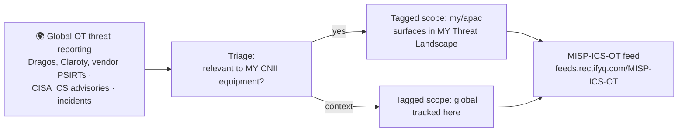

**Scope: global.** OT threats rarely respect borders — the same PLC firmware and protocols run in a plant in Johor and a utility in Poland. We track ICS/OT threats worldwide and flag where they touch **equipment and protocols common in Malaysian CNII** (energy, water, transport, manufacturing — per NCII sector definitions under the Cyber Security Act 2024).

## Sections

- **[[ics-ot/threats/index|OT Threat Entries]]** — compiled campaigns, malware, and incidents
- **[[ics-ot/ics-threat-landscape|OT/ICS Threat Landscape]]** — 	MITRE ATT&CK ICS Heatmap, ICS/OT active threat actors, and incident timelines.

> [!tip] Structured indicators
> The **MISP-ICS-OT feed** carries OT-specific events and context: `https://feeds.rectifyq.com/MISP-ICS-OT`. Setup: [[resources/guides/misp-feeds|feed guide]].

*This section serves [[intel-program/pir|PIR-05]] — threats to industrial and operational technology.*
