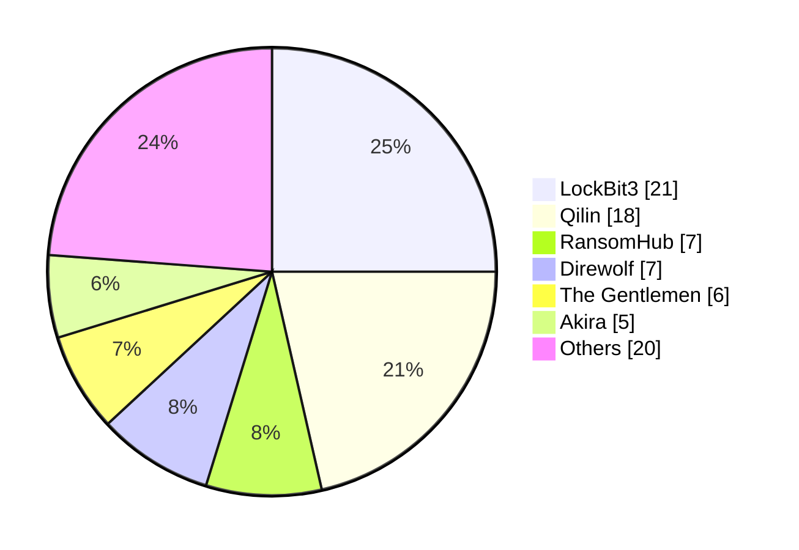
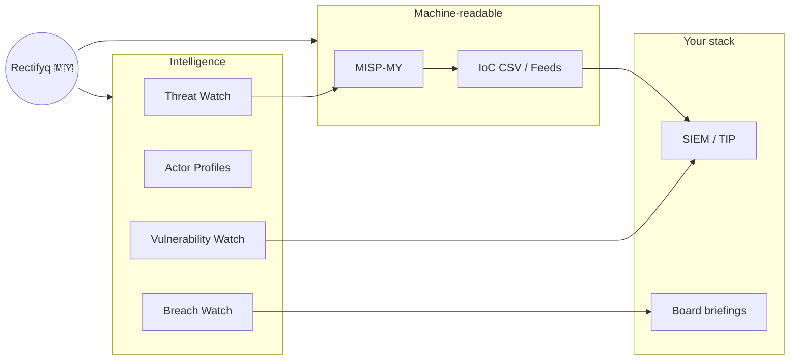

**Threat intelligence focusing on Malaysia 🇲🇾** — bridging global reporting with local reality. Compiled, tagged, and analyzed for Malaysian defenders, from SOC analysts to CISOs.

> [!tip] Baru di sini? New here?
> Head to **[[start-here/index|Start Here]]** — a 2-minute guide that routes you to the right section based on your role. Prefer raw data? Jump straight to **[[resources/feeds|Feeds & MISP]]**.

    

        200+
        Threat entries MISP-linked, MY-triaged
    

    

        47+
        Threat actors tracked with MY relevance
    

    

        80+
        Ransomware claims vs. MY orgs since 2018
    

## What Rectifyq tracks

### 🎯 Intelligence products

    <a href="/my-threat-landscape/threats/" class="product-tile">
        ⚔
        Threat Watch
        MISP-linked threat entries triaged for MY relevance
    </a>
    <a href="/my-threat-landscape/threat-actor/" class="product-tile">
        🎭
        Threat Actors
        47+ groups tracked with Malaysian relevance
    </a>
    <a href="/my-threat-landscape/vulnerabilities/" class="product-tile">
        🩹
        Vulnerability Watch
        CVEs with confirmed MY exposure
    </a>
    <a href="/my-threat-landscape/breaches/" class="product-tile">
        🕵️
        Breach Watch
        Ransomware claims & data leaks, victims masked
    </a>
    <a href="/my-threat-landscape/radar/" class="product-tile">
        📡
        Rectifyq Radar
        The monthly MY threat recap
    </a>

### 🤝 Community

    <a href="/events/" class="product-tile">
        📅
        Events
        Every MY cyber event, one calendar
    </a>
    <a href="/tanya-rectifyq/" class="product-tile">
        💬
        Tanya Rectifyq
        Ask anything about CTI
    </a>
    <a href="/MY-Threat-Landscape/phishhuntmy/" class="product-tile">
        🎣
        PhishHuntMY
        Phishing hunt challenge
    </a>
    <a href="/contribute/" class="product-tile">
        🤝
        Contribute
        Strengthen the ecosystem
    </a>

Everything published maps to our open **[[pir/index|Intelligence Requirements (PIR)]]** — so you always know *why* an entry exists and *who* it serves.

## The Malaysian landscape at a glance
### Ransomware extortion claims vs MY organizations — top groups (2018–present)

> [!warning] Claims, not confirmations
> Figures are based on ransomware group claims or news reporting. Unless the organization confirmed the incident, it remains a claim. Victims are never named on this site.

**Most-claimed sectors:** Manufacturing · Government · Engineering · Logistics · Construction — full breakdown in the [[my-threat-landscape/ransomware|Ransomware Tracker]].

**Top techniques observed in MY-relevant intrusions (MISP-MY):** [T1027](https://attack.mitre.org/techniques/T1027/) Obfuscated Files · [T1566](https://attack.mitre.org/techniques/T1566/) Phishing · [T1055](https://attack.mitre.org/techniques/T1055/) Process Injection · [T1059.001](https://attack.mitre.org/techniques/T1059/001/) PowerShell · [T1190](https://attack.mitre.org/techniques/T1190/) Exploit Public-Facing App — full heatmap in [[my-threat-landscape/ttps|TTPs]].

## This week in MY cyber 📅

CTF this weekend? Meetup after work? The community calendar has it — physical and online, reviewed before publishing.

> [!info] Subscribe once, never miss an event
> Add the **[[events|Malaysia Cybersecurity Events Calendar]]** to Google or Apple Calendar and every vetted MY cyber event lands in your schedule automatically. Organizing something? [[events|Submit it]] — jom turun padang.

## How the ecosystem connects

