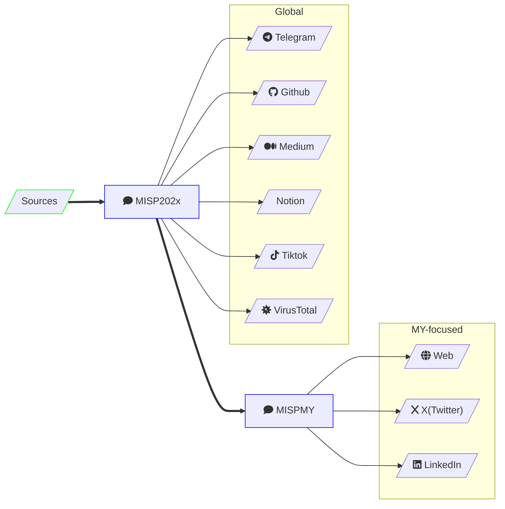

<link
  href="https://cdnjs.cloudflare.com/ajax/libs/font-awesome/7.0.0/css/all.min.css"
  rel="stylesheet"
/>

# 🇲🇾 Empowering Malaysia's Cyber Defense

> [!TIP] **Help us build the future**
> Rectifyq is evolving. Share your feedback or feature requests via our **[Google Form](https://forms.gle/Vfs3LFg9X6g2tibv7)**.

---

### 🛡️ The Mission
> [!ABSTRACT] **A Personal Initiative for National Resilience**
> Rectifyq is a self-funded, personal project dedicated to refining the Malaysian cybersecurity ecosystem. It’s a space for continuous learning, data sharing, and collective defense—bridging the gap between global intelligence and local reality.

---

## 🔍 Addressing the "Malaysian Gap"

Global threat reports often overlook our region. Rectifyq focuses on:

* **Localized Intelligence:** Moving beyond Western-centric APT reports to focus on threats hitting 🇲🇾 infrastructure.
* **Strategic Justification:** Providing concrete, local data to help leaders justify cybersecurity investments.
* **Actionable Contribution:** Providing a structured platform for local analysts to share findings and grow together.

---

## 🕸️ Ecosystem Map
Our intelligence flows through several specialized channels. Click any node below to explore.

---

