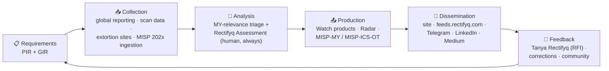

Not a mission statement — the machine itself. Every phase below maps to something observable on this site.

## The pieces

- **[[intel-program/pir|PIR 2026]]** — priority requirements, with per-PIR coverage counts. Requirements with receipts.
- **[[intel-program/gir|GIR]]** — the standing baseline collected regardless of priorities.
- **[[intel-program/rfi|Ad-hoc RFI]]** — how to ask for something specific. Intake: [[tanya-rectifyq/index|Tanya Rectifyq]].
- **[[intel-program/cti-cmm|CTI-CMM Self-Assessment]]** — honest maturity scores against the community model, revisited yearly.

> [!note] Why publish this?
> Most intel programs hide their requirements. Publishing ours means you always know why an entry exists, who it serves, and where the gaps are — and it keeps us honest.
