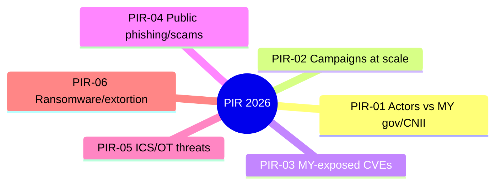

Reviewed annually; changelog at the bottom. Every published entry carries a `pir:` tag — so coverage below is verifiable against the tag pages, not aspirational.

| PIR | Requirement | Primary stakeholder | Coverage (qtr) |
| --- | --- | --- | --- |
| PIR-01 | Which threat actors are targeting Malaysian government, GLCs, and CNII, and with what TTPs? | Gov/GLC/CNII SOC & CTI | <!-- n entries --> |
| PIR-02 | Which campaigns and malware families are affecting Malaysian organizations at scale? | SOC analysts | <!-- n --> |
| PIR-03 | Which vulnerabilities have confirmed or probable Malaysian exposure, and are they being exploited? | CISO, vuln mgmt | <!-- n --> |
| PIR-04 | Which phishing and scam campaigns are targeting the Malaysian public (APK scams, banking lures)? | Public, awareness teams | <!-- n --> |
| PIR-05 | Which ICS/OT threats touch equipment and protocols common in Malaysian CNII? | CNII operators, OT engineers | <!-- n --> |
| PIR-06 | Which ransomware/extortion groups are claiming Malaysian victims, and what are their entry paths? | CISO, management | <!-- n --> |

<!-- ADJUST: align with your internal PIR set if it differs; update counts quarterly (manual, or via n8n later) -->

## How to use this page

Map these against your own organization's PIRs. Where they overlap, our tags (`pir: [PIR-XX]`) let you filter exactly the entries that serve your requirement — a free extension of your collection plan.

## Changelog

| Date | Change |
| --- | --- |
| 2026-01 | PIR set published; PIR-05 (ICS/OT) elevated to match MISP-ICS-OT feed depth |
