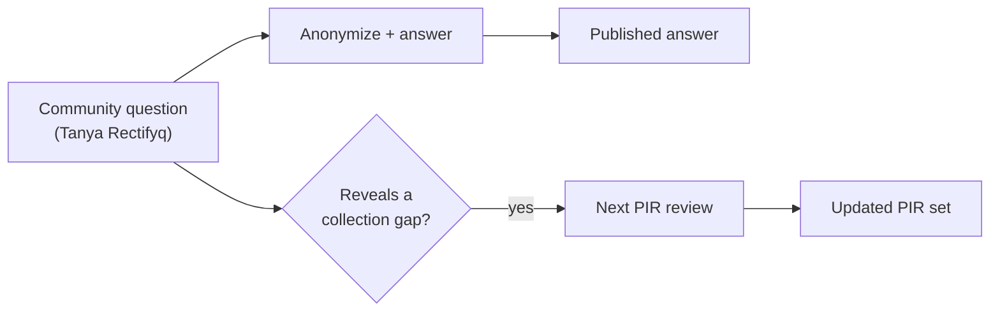

Have a question the published products don't answer? That's an RFI.

## How it works

1. **Ask via [[tanya-rectifyq/index|Tanya Rectifyq]]** — ask@rectifyq.com NGL, or DM on any channel. Casual front door, same intake.
2. Questions are anonymized. Answers publish publicly where possible (TLP permitting).
3. **Expectations, honestly:** this is a one-person, self-funded initiative. Public-interest questions get prioritized; there is no SLA. For incident response, go to NACSA / MyCERT Cyber999 — [[contact|Contact]].

## The feedback loop

Recurring questions reveal collection gaps. Gaps feed the next [[intel-program/pir|PIR review]]. Your question literally shapes what gets tracked next year.

