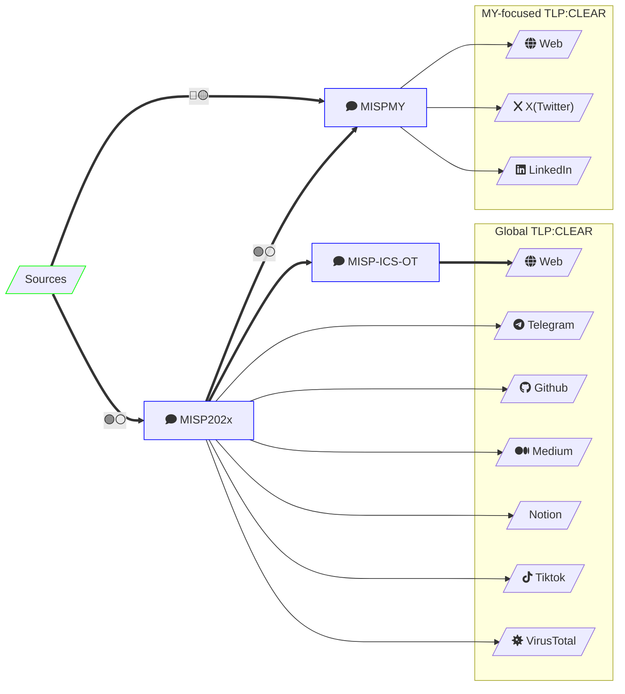

## Rules the pipeline follows

1. **The Assessment is always human-written.** Ingestion can be automated; judgment is not.
2. **Claims vs confirmations** are always distinguished ([[MY-Threat-Landscape/breaches/index|Breach Watch policy]]).
3. **Victims are never named** — masked descriptors and sectors only.
4. **Aggregate exposure only** — never listable vulnerable IPs.
5. **TTP-first attribution** — vendor actor names recorded as context, not endorsed as fact.
6. **Honest MITRE mapping** — when a technique resists direct prevention (e.g., discovery techniques, unauthenticated OT protocols), we frame detection/monitoring rather than inventing mitigations.
7. **Corrections are published transparently.**

## Cadence, honestly

Entries publish as triaged (solo capacity — quality over schedule); the [[MY-Threat-Landscape/vulnerabilities/index|vulnerability sweep]] runs weekly-ish; [[radar/index|Radar]] monthly; [[intel-program/pir|PIR review]] annually.
