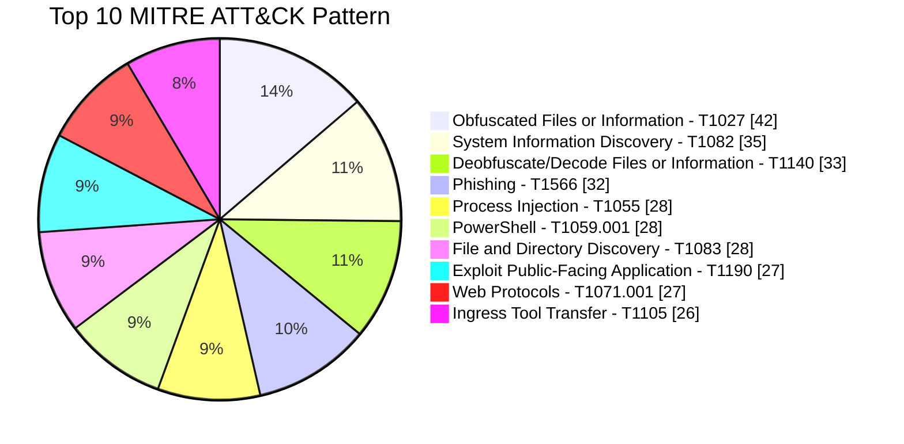
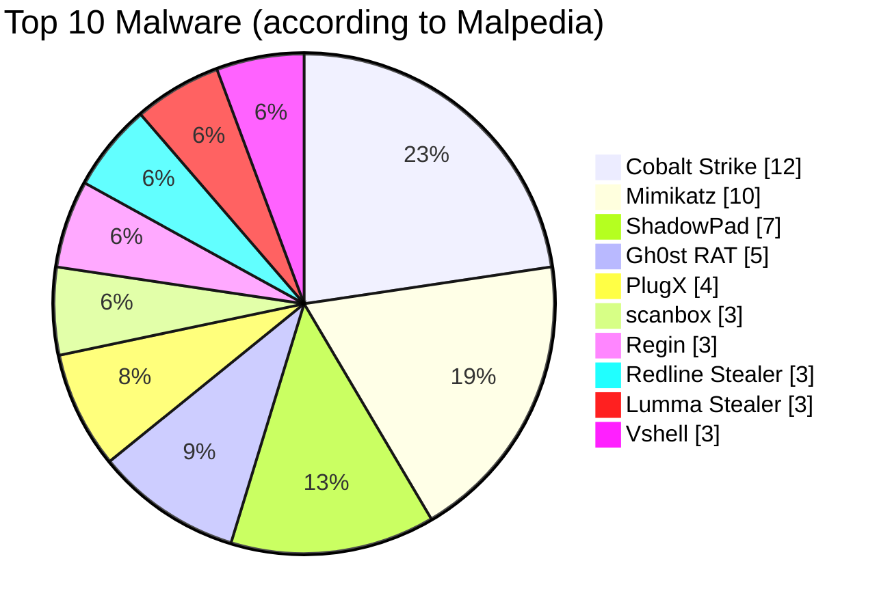

## At a glance

The techniques seen most often in Malaysia-relevant events in Rectifyq's MISP-MY dataset are **Obfuscated Files or Information (T1027)**, **System Information Discovery (T1082)**, **Deobfuscate/Decode Files or Information (T1140)** and **Phishing (T1566)**. **Cobalt Strike, Mimikatz and ShadowPad** are the most frequently tagged malware and tools. Counts are the number of MISP-MY events tagged with each technique or Malpedia family, so one campaign can contribute to several techniques.

### Top 10 techniques

| Rank | Technique | ID | Malaysia-relevant MISP events |
| --- | --- | --- | --- |
| 1 | Obfuscated Files or Information | [T1027](https://attack.mitre.org/techniques/T1027/) | 42 |
| 2 | System Information Discovery | [T1082](https://attack.mitre.org/techniques/T1082/) | 35 |
| 3 | Deobfuscate/Decode Files or Information | [T1140](https://attack.mitre.org/techniques/T1140/) | 33 |
| 4 | Phishing | [T1566](https://attack.mitre.org/techniques/T1566/) | 32 |
| 5 | Process Injection | [T1055](https://attack.mitre.org/techniques/T1055/) | 28 |
| 6 | PowerShell | [T1059.001](https://attack.mitre.org/techniques/T1059/001/) | 28 |
| 7 | File and Directory Discovery | [T1083](https://attack.mitre.org/techniques/T1083/) | 28 |
| 8 | Exploit Public-Facing Application | [T1190](https://attack.mitre.org/techniques/T1190/) | 27 |
| 9 | Web Protocols | [T1071.001](https://attack.mitre.org/techniques/T1071/001/) | 27 |
| 10 | Ingress Tool Transfer | [T1105](https://attack.mitre.org/techniques/T1105/) | 26 |

### Top 10 malware and tools (Malpedia tags)

| Rank | Malware / tool | MISP events |
| --- | --- | --- |
| 1 | Cobalt Strike | 12 |
| 2 | Mimikatz | 10 |
| 3 | ShadowPad | 7 |
| 4 | Gh0st RAT | 5 |
| 5 | PlugX | 4 |
| 6 | scanbox | 3 |
| 7 | Regin | 3 |
| 8 | Redline Stealer | 3 |
| 9 | Lumma Stealer | 3 |
| 10 | Vshell | 3 |

## Heatmap and charts

### Latest MITRE ATT&CK heatmap for Malaysia (source: Rectifyq MISP-MY)

### Top 10 MITRE ATT&CK techniques (chart)

### Top 10 malware (chart)

