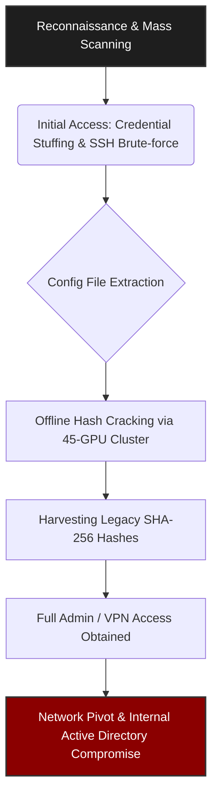

**Status:** Confirmed · **Group:** Multi-operator syndicate · **Sector:** Multi-sector · **Victim:** Multiple (Global & Malaysia)

## What we know
In mid-June 2026, a massive campaign dubbed "FortiBleed" was uncovered, exposing working administrator and VPN credentials for approximately 75,000 internet-facing Fortinet FortiGate firewalls across 194 countries. 
*   **The Root Cause**: Attackers actively exploited publicly exposed management interfaces and a legacy password-hashing weakness to compromise devices. 
*   **The Attack Chain**: Using credentials sourced from prior breach dumps and infostealer logs, attackers executed credential stuffing and SSH brute-force attacks to gain initial access and extract device configuration files. 
*   **Offline Cracking**: Extracted configuration files contained administrator credentials stored using weaker SHA-256 with Salt hashes. 
*   **The PBKDF2 Gap**: Although Fortinet introduced stronger PBKDF2 hashing in newer FortiOS updates, the upgrade only takes effect after an administrator actively re-authenticates. 
*   **Attacker Infrastructure**: The threat actors utilized a dedicated 45-GPU cluster managed via Hashtopolis to crack intercepted SSL VPN authentication hashes offline at an unprecedented scale. 
*   **Persistence**: Once cracked, the attackers used the firewalls as listening posts to capture internal authentication hashes (NTLM/Kerberos) and systematically pivot directly into Active Directory environments.
 

### Attack Chain Visualization

## Apa maksudnya untuk Malaysia? 🇲🇾
On the local front, the National Cyber Coordination and Command Centre (NC4) released a High-Severity advisory (NC4-ALR-2026-000002) acknowledging the extensive impact of the FortiBleed campaign.
- Local Impact: The NC4 explicitly noted that affected devices span critical sectors including government, telecommunications, financial services, healthcare, education, and critical infrastructure.
- Advisory Stance: NC4 assesses the ongoing incidents stem from the widespread exposure and misuse of valid credentials rather than a newly disclosed zero-day exploit.
- Actionable Threat Intel: For Malaysian organizations, patching the firewall firmware is critically insufficient if legacy credentials were leaked and hashes remain active.
- Remediation Steps: Organizations must ensure all administrators log in to trigger the PBKDF2 hash upgrade, remove management interfaces from the public internet, enforce multi-factor authentication (MFA) on all remote access points, and actively hunt for backdoor administrator accounts or altered security settings.

## Statistics
Affected Malaysian domains

| TLD | At least |
| --- | --- |
| .gov.my | 9 |
| .edu.my | 12 |
| .org.my | 2 |
| .com.my or .my | 60 + |

| Metric | Detail |
| --- | --- |
| Global Exposed Firewalls | ~75,000 devices |
| Affected Countries | 194 |
| Unique Affected Domains | 21,632 |
| Credential Attempts | 1.16 billion |

## Timeline

| Date | Event | Link |
| --- | --- | --- |
| 2026-06-13 | Security researcher Bob Diachenko publicly reports an exposed attacker directory containing FortiGate credentials. | [link](https://www.linkedin.com/feed/update/urn:li:activity:7471222472193830913/) |
| 2026-06-19 | NC4 Malaysia issues High-Severity advisory NC4-ALR-2026-000002 to alert critical sectors.| [link](https://www.nc4.gov.my/alertAdvisory-detail/NC4-ALR-2026-000002) |
| 2026-06-19 | Fortinet released analysis for this FortiBleed incident. | [link](https://www.fortinet.com/blog/psirt-blogs/analysis-of-reported-credential-compromise-of-fortigate-devices) |

Check if you are listed at [Hudson Rock](https://www.hudsonrock.com/fortinet)
More information and full list available at [MISP2026 - Event ID:706](https://misp2026.rectifyq.com/events/view/706)

*Updates appended as status changes. Policy: [[my-threat-landscape/breaches/index|Breach Watch]].*
