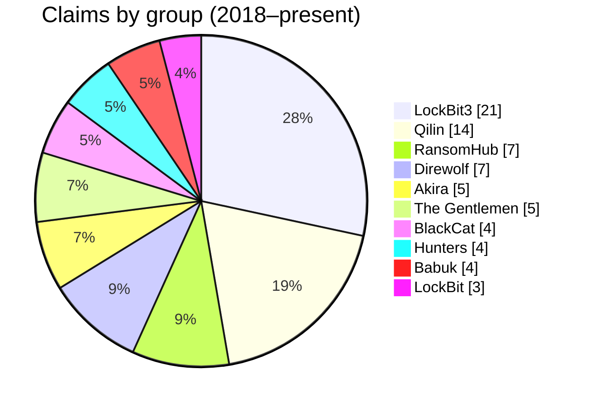

One view of what is actually hitting Malaysia — compiled from [[my-threat-landscape/threats/index|Threat Watch]], [[my-threat-landscape/breaches/index|Breach Watch]], [[my-threat-landscape/vulnerabilities/index|Vulnerability Watch]], and the [[my-threat-landscape/threat-actors|Actor Tracker]].

## Ransomware claims vs MY organizations

> [!warning] Claims, not confirmations
> Unless the organization confirmed an incident, it remains a claim. Victims are never named. [[my-threat-landscape/breaches/index|Editorial policy →]]

**Recent movement (2026):** Qilin remains the most prolific global operator and continues claiming Malaysian victims; The Gentlemen (emerged Sep 2025) has been actively claiming MY organizations including in the transport sector; a newer group, Payload, claimed a Malaysian hospitality group in June 2026. Full log: [[my-threat-landscape/ransomware|Ransomware Tracker]].

## Most-claimed sectors

Manufacturing · Government/Administration · Academia · Logistics · Electronics · Multi-sector conglomerates — the tracker timeline runs back to 2018 (first recorded claim: a television broadcaster).

## Top techniques in MY-relevant intrusions (MISP-MY)

| Technique | Name | Where it shows up |
| --- | --- | --- |
| [T1566](https://attack.mitre.org/techniques/T1566/) | Phishing | Initial access in most campaigns; APK scam waves targeting MY banking users |
| [T1190](https://attack.mitre.org/techniques/T1190/) | Exploit Public-Facing Application | Perimeter compromise; ransomware affiliates mass-exploiting edge CVEs (e.g., Fortinet CVE-2024-55591, CVE-2024-21762) |
| [T1027](https://attack.mitre.org/techniques/T1027/) | Obfuscated Files or Information | Commodity malware and APT tooling alike |
| [T1059.001](https://attack.mitre.org/techniques/T1059/001/) | PowerShell | Post-exploitation staple |
| [T1055](https://attack.mitre.org/techniques/T1055/) | Process Injection | Commodity + APT |

## Active actor clusters with MY relevance

Heavily China-nexus among APTs — UNC3886, APT40, Earth Estries, Earth Lusca, ToddyCat, Naikon among the tracked clusters — alongside North Korean (Lazarus Group, Kimsuky), Russian, Iranian, and regional hacktivist activity (e.g., R00TK1T, INDOHAXSEC-TEAM). LockBit3, Qilin, and RansomHub dominate the ransomware claim count.

Full tracker with origin clustering: [[my-threat-landscape/threat-actor|Threat Actors →]]

## ICS/OT entries relevant to Malaysia

OT threats are tracked globally with a Malaysian CNII lens — entries tagged `scope: my/apac` surface here
