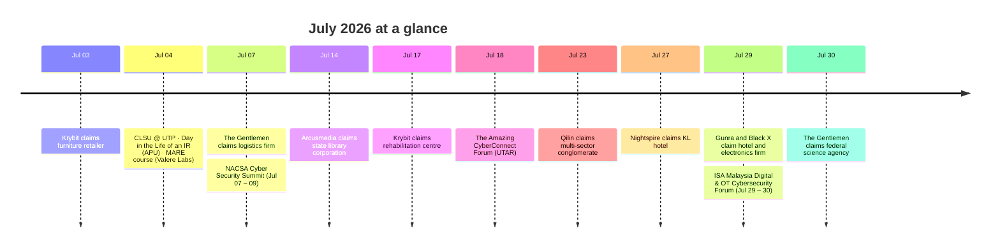

## TL;DR

- **9 Ransomware & Breach Claims:** The Gentlemen (logistics firm and a federal science agency) and Krybit (furniture retailer and rehabilitation centre) claimed two each, with single claims by Qilin, Arcusmedia, Nightspire, Gunra, and Black X across government, hospitality, and electronics.
- **Infrastructure & Gov Incidents:** NACSA issued critical advisories following the Health Ministry website compromise (Mushr00w), while a separate attack (MelayuSpiritual) disrupted Flexi Parking operations in Selangor.
- **Active Regional Campaigns:** MyCERT flagged active Android banking trojans, and researchers noted Malaysia-specific targeting by TA4922 and SharpPanda.

---

## Ransomware & Breach Claims

A total of nine ransomware claims targeting Malaysian organizations were tracked this month.

| Date | Threat Group | Claimed Victim | Reference |
| :--- | :--- | :--- | :--- |
| **Jul 03** | krybit | Ma** Ho** Fur******* Sd* Bh* | [Ransomware.live](https://www.ransomware.live/id/bWFqdWhvbWUuY29tLm15QGtyeWJpdA==) |
| **Jul 07** | the gentlemen | Qua***** Log****** Sdn Bhd | [Ransomware.live](https://www.ransomware.live/id/UXVhbnRlcm0gTG9naXN0aWNzIFNkbiBCaGRAdGhlZ2VudGxlbWVu) |
| **Jul 14** | Arcusmedia | Per******* | [Ransomware.live](https://www.ransomware.live/group/arcusmedia) |
| **Jul 17** | krybit | Pus** Reh********* PER**** | [Ransomware.live](https://www.ransomware.live/id/cmVoYWJtYWxheXNpYS5jb21Aa3J5Yml0) |
| **Jul 23** | Qilin | Sun*** Ber*** | [Ransomware.live](https://www.ransomware.live/id/U3Vud2F5IEJlcmhhZEBxaWxpbg==) |
| **Jul 27** | Nightspire | Fur*** Buk** Bin**** | [Ransomware.live](https://www.ransomware.live/group/nightspire) |
| **Jul 29** | Gunra | Wei****** | [Ransomware.live](https://www.ransomware.live/group/gunra) |
| **Jul 29** | Black X | Ton* Kon* E & E Sdn Bhd | [Ransomware.live](https://www.ransomware.live/group/black%20x) |
| **Jul 30** | the gentlemen | Mal******* Nuc**** Age*** | [Ransomware.live](https://www.ransomware.live/group/thegentlemen) |

---

## Incidents & Advisories

- **FortiBleed Credential Compromise:** Threat actors are leveraging credentials from prior compromises (FG-IR-26-060, FG-IR-25-647) and brute-forcing (`T1589.001`, `T1110`) FortiGate devices lacking MFA. Unpatched or unverified FortiGates remain the primary ransomware affiliate front door. [[Source](https://www.fortinet.com/blog/psirt-blogs/analysis-of-reported-credential-compromise-of-fortigate-devices)]
- **Govt Agency Defacements:** NACSA urged immediate patching following Health Ministry website compromises (`T1491`, `T1505.003`, `T1190`) attributed to **Mushr00w**. [[Source](https://www.thestar.com.my/tech/tech-news/2026/06/27/nacsa-issues-advisory-on-critical-vulnerability-related-to-hack-of-health-ministrys-website)]
- **Logistics Disruption:** Electronic payment operations for Flexi Parking in Selangor were severely degraded following a cyber attack (`T1491`) by **MelayuSpiritual**, exposing user records. [[Source](https://najoe.substack.com/p/cyber-attack-cripples-flexi-parking)]

---

## Threat Intelligence & Research

### Malaysia-Specific Targeting
- **SharpPanda (Pelagos Intel):** Artifact loaders were observed utilizing localized political/policy lures, indicating direct context for Malaysia-focused analysis. [[Read](https://research.pelagos-intel.com/sharppanda-strike-again)]
- **Android Banking Trojans (MyCERT):** Multi-variant malware campaigns (Delivery4U / KerjaExpress / MaxTag) are actively targeting Malaysian online banking users. [[Advisory](https://www.mycert.org.my/portal/advisory?id=MA-1451.062026)]
- **Phantom Casino (Syntx):** Local gambling operators successfully hijacked Malaysian government web domains to construct SEO-driven casino funnels. [[Read](https://www.syntx.com.my/blog/phantom-casino)]
- **Travel Phishing Surge (Check Point):** Cybercriminals are exploiting travel spikes by creating spoofed "presale price" deal sites for Malaysian resorts to steal deposits. [[Read](https://blog.checkpoint.com/research/travel-phishing-and-cyber-attacks-are-surging-in-2026-growing-122-over-the-last-3-years-heres-what-cyber-criminals-are-actually-doing/)]

### Global Campaigns with Local Impact
- **TA4922 Expansion (Proofpoint):** The suspected Chinese crime group continues to scale operations, heavily prioritizing Malaysia alongside Taiwan, Japan, and Singapore. [[Read](https://www.proofpoint.com/us/blog/threat-insight/ta4922-suspected-chinese-crime-group-going-global)]
- **Havoc Stager via MS Defender (LevelBlue):** A stager DLL bypassing Microsoft Defender DLP was discovered operating on Malaysia-registered infrastructure. [[Read](https://www.levelblue.com/blogs/spiderlabs-blog/the-demon-arrives-later-a-havoc-stager-hides-behind-microsoft-defender-dlp)]
- **Legacy WinRAR Flaws (Trend Micro):** Attacks against Ukrainian entities were traced back to command servers hosted on a Malaysian VPS provider (Evoxt, AS149440). [[Read](https://www.trendmicro.com/en_us/research/26/f/old-winrar-flaw-fuels-attacks-on-ukraine.html)]
- **AryStinger Botnet (Qianxin):** Over 4,000 legacy routers have been co-opted globally, with 3.5% of the compromised nodes located in Malaysia. [[Read](https://blog.xlab.qianxin.com/arystinger-botnet-hijacks-legacy-routers-for-global-attacks-en/)]
- **Claude.ai Malvertising (Trend Micro):** Abused shared chat features in Google Ads heavily targeted traffic in Malaysia, Taiwan, and Japan. [[Read](https://www.trendmicro.com/en_us/research/26/f/claudeai-shared-chat-abused-in-malvertising.html)]
- **WhatsApp VBS Campaigns (Kaspersky):** Malicious VBS scripts distributed via WhatsApp are broadly affecting users in Malaysia and other regions. [[Read](https://securelist.com/whatsapp-vbs-rmm-campaign/120290/)]
- **Maritime Sanctions Evasion (Recorded Future):** Cyber-tracking exposed a bulk carrier detained in Port Kelang under the Tokyo MOU. [[Read](https://www.recordedfuture.com/research/cyber-maritime-sanctions-evasion)]

---

## Community Events 📅

### Wrapped (July 2026)
- **[Jul 04 – 05] Cyber Skills Level Up! (CLSU)** — Free student event at UTP by RE:HACK and CYBERHAX UTP. 
- **[Jul 04] Day In the Life of an Incident Responder** — Session organized by APU FSECSS. 
- **[Jul 04] Malware Analysis and Reverse Engineering** — Practical, hands-on evening course by Valere Labs. 
- **[Jul 07 – 09] NACSA Cyber Security Summit (NCSS)** — National summit co-organized by NACSA and AIS.
- **[Jul 18] The Amazing CyberConnect Forum** — Interactive forum by UTAR FICT and Kampar Cybersecurity Club.
- **[Jul 29 - 30] ISA Malaysia Section – Digital & OT Cybersecurity Forum 2026** — Conference on OT Security.

### Upcoming (August – September 2026)

- **[Aug 01 – 02] Red Teaming L1 Workshop** — Practical internal network and AD attack labs. [[Register](https://docs.google.com/forms/d/e/1FAIpQLScMMd7WS3cdShAkRjQETxWFd-VyM4eop-PVYxsbuSEdvcOxQg/viewform)]
- **[Aug 12] MYCyber Leaders Summit 2026** — Summit for Cybersecurity leaders. [[Register](https://cybersecasia.org/mycyber2026)]
- **[Sep 06] SUNCTF 2026** — Sunway University SunCTF2026 [[Register](https://docs.google.com/forms/d/e/1FAIpQLSf3ld8PpBwlmMgwyD1wUVKYUsHVTRPtXI5ghf_K-jmr48_hOQ/viewform)]
- **[Sep 10] Cyber Security Summit (Exito)** — Summit for Cybersecurity leaders. [[Register](https://exito-e.com/cybersecuritysummit/malaysia/)]
- **[Sep 22-24] Parallel Pulse Training 2026** — Cybersecurity technical trainings. [[Register](https://pulse.nanosec.asia/)]
  
---

