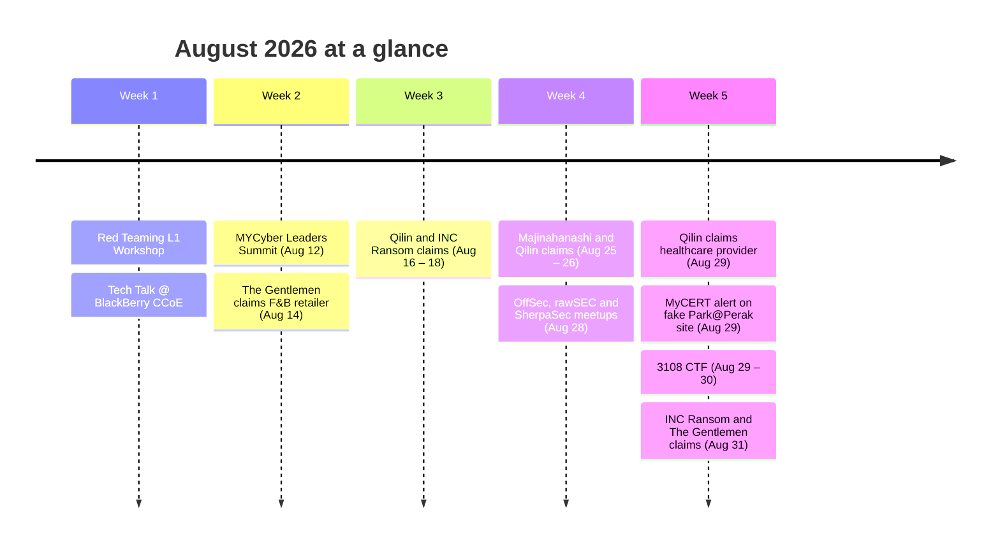

## TL;DR

- **8 Ransomware Claims:** Qilin (3), The Gentlemen (2), INC Ransom (2), and Majinahanashi (1) claimed Malaysian organizations across engineering, healthcare, food & beverage, manufacturing, and financial services.
- **Mobile Threat:** MyCERT warned of a fake Park@Perak parking site delivering a multi-stage iOS exploit chain to iPhone users.
- **AI-Driven Exploitation:** Unit 42 documented a Chinese-speaking actor using LLM-driven tooling to repeatedly exploit a Malaysian government entity's Citrix NetScaler appliance.

---

## Ransomware & Breach Claims

A total of eight ransomware claims targeting Malaysian organizations were tracked this month. Qilin remained the most active group against local victims, while INC Ransom returned with two claims.

| Date | Threat Group | Claimed Victim | Sector | Reference |
| :--- | :--- | :--- | :--- | :--- |
| **Aug 14** | The Gentlemen | T** Co**** Be** | Retail (F&B) | [Ransomware.live](https://www.ransomware.live/group/thegentlemen) |
| **Aug 16** | Qilin | Des***** Sdn Bhd | Food | [Ransomware.live](https://www.ransomware.live/group/qilin) |
| **Aug 18** | INC Ransom | S* As******** Sdn Bhd | Engineering | [Ransomware.live](https://www.ransomware.live/group/incransom) |
| **Aug 25** | Majinahanashi | P** Gr*** Sdn* Bhd* | Engineering | [Ransomware.live](https://www.ransomware.live/group/majinahanashi) |
| **Aug 26** | Qilin | Ken** Res****** | Environment | [Ransomware.live](https://www.ransomware.live/group/qilin) |
| **Aug 29** | Qilin | Car******** | Health | [Ransomware.live](https://www.ransomware.live/group/qilin) |
| **Aug 31** | INC Ransom | ci**************** | Investment | [Ransomware.live](https://www.ransomware.live/group/incransom) |
| **Aug 31** | The Gentlemen | E* Man********** Bhd | Manufacturing | [Ransomware.live](https://www.ransomware.live/group/thegentlemen) |

*Dates are when the claim was discovered on the group's leak site. References link to the group's page, not the victim's. Claims remain claims until the organization confirms. See the [[my-threat-landscape/breaches/index|Breach Watch policy]].*

---

## Incidents & Advisories

- **Fake Park@Perak Site Targeting iPhone Users (MyCERT):** A lookalike of the Park@Perak parking portal (`parkpeark[.]xyz`) was observed delivering a multi-stage iOS exploit chain. Use only the official portal (`park.perak.my`), keep iOS updated, and consider Lockdown Mode for high-risk users. [[Advisory](https://www.mycert.org.my/portal/advisory?id=MA-1480.082026)]

### Carried over from late July
These advisories were published after the July recap went out and are still relevant:
- **Ransomware Prevention Best Practices (MyCERT):** Issued in response to recently observed ransomware activity. [[Advisory](https://www.mycert.org.my/portal/advisory?id=MA-1479.072026)]
- **Multiple Fortinet Vulnerabilities (MyCERT):** Fortinet edge devices remain a primary ransomware entry point, so patch them first. [[Advisory](https://www.mycert.org.my/portal/advisory?id=MA-1478.072026)]
- **WordPress Core Pre-Auth RCE "wp2shell" (NC4, Critical):** Active exploitation reported. [[Alert](https://www.nc4.gov.my/)] (`NC4-ALR-2026-000006`)

---

## Threat Intelligence & Research

### Malaysia-Specific Targeting
- **AI-Driven Exploitation of a Malaysian Government Entity (Unit 42):** A Chinese-speaking actor (aliases *knaithe* / *KnYuan*) ran an LLM-assisted autonomous campaign against roughly 460 targets in China, Malaysia, and a third country. A Malaysian government entity was hit repeatedly over several days via a Citrix NetScaler out-of-bounds read (CVE-2026-3055), with the actor hunting for session cookies to hijack. Published 30 July. [[Read](https://unit42.paloaltonetworks.com/autonomous-ai-cyber-attack-campaign/)]

---

## Community Events 📅

### Wrapped (August 2026)
- **[Aug 01, 07 – 08] Red Teaming L1 Workshop**: Online internal network and AD attack labs.
- **[Aug 04] Tech Talk: Malaysia's Cyber Battleground 2026**: BlackBerry Cybersecurity Center of Excellence.
- **[Aug 09] NADI x Cybersecurity Perwira Cyber & CTF 2026**: Online.
- **[Aug 12] MYCyber Leaders Summit 2026**: Kuala Lumpur.
- **[Aug 20] A Day in the Life of a GRC Consultant**: Online.
- **[Aug 21] Renewable Energy Risk Assessment Workshop**: BlackBerry CCoE.
- **[Aug 28] OffSec Malaysia Chapter 4th Meetup**: "MCP: The New Frontier of AI Security" at UNITEN Putrajaya.
- **[Aug 28] MAWAR (Malam Wayang)**: rawSEC x Fortinet at GSC Mid Valley.
- **[Aug 28] SherpaSec x BlackBerry CCoE Industrial Visit**.
- **[Aug 29] Intro to CTF: Capture Your First Flag**: Online.
- **[Aug 29 – 30] 3108 CTF · Warisan Takhta**: Online CTF by Bahtera Siber.

### Upcoming (September – October 2026)
- **[Sep 01] Parallel Pulse 2026 CFP closes**. [[Submit](https://cfp.nanosec.asia/pulse2026/cfp)]
- **[Sep 06] SUNCTF 2026**: Sunway College. [[Register](https://docs.google.com/forms/d/e/1FAIpQLSf3ld8PpBwlmMgwyD1wUVKYUsHVTRPtXI5ghf_K-jmr48_hOQ/viewform)]
- **[Sep 06] HTB Meetup: IIUM – Active Directory Certificate Services**: Online. [[RSVP](https://www.meetup.com/hack-the-box-meetup-kuala-lumpur-my/events/316040447/)]
- **[Sep 09] Mandiant Community Night – Kuala Lumpur**: Google KL. [[RSVP](https://rsvp.withgoogle.com/events/mandiant-community-night-kl-2026-sept)]
- **[Sep 10] Cyber Security Summit (Exito)**: Kuala Lumpur. [[Register](https://exito-e.com/cybersecuritysummit/malaysia/)]
- **[Sep 15] A Day in the Life of a Cyber Threat Intelligence Analyst**: Online. [[Register](https://luma.com/mdgwty7m)]
- **[Sep 22 – 24] Parallel Pulse Training 2026**. [[Info](https://pulse.nanosec.asia/)]
- **[Sep 25] rawSEC September Meetup**: Maxis Tower. [[Info](https://mcco.org.my/events/rawsec-september-meetup-2026)]
- **[Sep 28] Parallel Pulse Conference 2026**. [[Info](https://pulse.nanosec.asia/)]
- **[Oct 02 – 03] Girls in CTF 2026 (GCTF)**: Registration closes Sep 19. [[Info](https://girls-in-ctf.site/)]
- **[Oct 05 – 07] CyberDSA**: MITEC, Kuala Lumpur. [[Info](https://www.cyberdsa.com/)]

---

