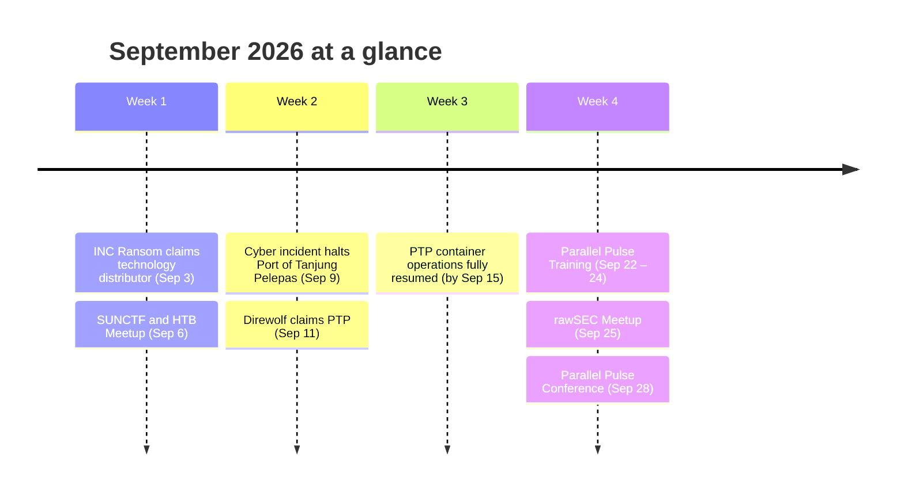

## TL;DR

- **CNII Disruption:** A cyber incident suspended container terminal operations at Port of Tanjung Pelepas (PTP) on 9 September. Direwolf claimed responsibility two days later. The operator has confirmed the incident but not ransomware or data theft.
- **2 Ransomware Claims:** Direwolf (port operator) and INC Ransom (technology distributor). It was a quiet month after August's eight claims.
- **Advisories:** No new MyCERT advisories or NC4 alerts were published in September.

---

## Ransomware & Breach Claims

A total of two ransomware claims targeting Malaysian organizations were tracked this month.

| Date | Threat Group | Claimed Victim | Sector | Reference |
| :--- | :--- | :--- | :--- | :--- |
| **Sep 03** | INC Ransom | My* Glo*** Ser***** Sdn Bhd | Technology | [Ransomware.live](https://www.ransomware.live/group/incransom) |
| **Sep 11** | Direwolf | Po** of Ta***** Pe***** | Transport | [Ransomware.live](https://www.ransomware.live/group/direwolf) |

*Dates are when the claim was discovered on the group's leak site. References link to the group's page, not the victim's. Claims remain claims until the organization confirms. See the [[my-threat-landscape/breaches/index|Breach Watch policy]].*

---

## Incidents & Advisories

- **Port of Tanjung Pelepas Operations Halted (Transport / CNII):** At about 23:34 on 9 September, a cyber incident hit the terminal operating systems at PTP in Johor, one of the world's largest transhipment hubs (14 million+ TEU in 2025). Affected systems were isolated and cargo handling suspended. Manual gate processing began on 10 September, and container operations had fully resumed by 15 September. Direwolf listed PTP on its leak site on 11 September. The operator has confirmed a "cyber incident" but **not** ransomware or data theft, so treat the attribution as a claim. [[WorldCargo News](https://www.worldcargonews.com/news/2026/09/port-of-tanjung-pelepas-resumes-operations-after-cyber-attack/)] · [[Lloyd's List](https://www.lloydslist.com/LL1158420/Cyber-attack-disrupts-operations-at-Malaysia%E2%80%99s-Port-of-Tanjung-Pelepas)] · [[The Loadstar](https://theloadstar.com/cyber-attack-halts-operations-at-malaysias-tanjung-pelepas-port/)]
- **Why it matters:** This is the clearest 2026 case of a cyber incident causing physical operational disruption to Malaysian CNII. Maritime operators and logistics firms that depend on PTP should review their IT/OT segmentation and manual-fallback procedures. Context: [[ics-ot/ics-threat-landscape|ICS/OT Threat Landscape]].
- **No new national advisories:** MyCERT and NC4 published no new advisories in September. Still-relevant advisories from August are in the [[my-threat-landscape/radar/2026-08|August recap]].

---

## Threat Intelligence & Research

No new Malaysia-specific vendor research was identified this month. Seen something we missed? Tell us via [[tanya-rectifyq/index|Tanya Rectifyq]].

---

## Community Events 📅

### Wrapped (September 2026)
- **[Sep 06] SUNCTF 2026**: Sunway College.
- **[Sep 06] HTB Meetup: IIUM – Active Directory Certificate Services**: Online.
- **[Sep 09] Mandiant Community Night – Kuala Lumpur**: Google KL.
- **[Sep 10] Cyber Security Summit (Exito)**: Kuala Lumpur.
- **[Sep 15] A Day in the Life of a Cyber Threat Intelligence Analyst**: Online.
- **[Sep 22 – 24] Parallel Pulse Training 2026**.
- **[Sep 25] rawSEC September Meetup**: Maxis Tower.
- **[Sep 28] Parallel Pulse Conference 2026**.

### Upcoming (October 2026)
- **[Oct 02 – 03] Girls in CTF 2026 (GCTF)**: Qualification and final, online. [[Info](https://girls-in-ctf.site/)]
- **[Oct 05 – 07] CyberDSA**: MITEC, Kuala Lumpur. [[Info](https://www.cyberdsa.com/)]
- **[Oct 21 – 23] Certified Web Appsec Expert 2026**: PARKROYAL COLLECTION Kuala Lumpur. [[Info](https://thomvell.com/sources/programs/Cert%20WAE%2026.pdf)]
- **[Oct 31] RawSEC Minicon 2026**: Leo Moggie Convention Centre (LMCC). [[Register](https://payment.mcco.org.my/minicon-2026)]
- **[Oct 31] RE:HACK RE:BOOT 2027 CFP closes**.

---

