## At a glance (as of 8 October 2026)

- **China-nexus espionage groups dominate** Rectifyq's Malaysia-relevant reporting. **APT41**, **APT40** and **Naikon** appear in the most entries; other active China-nexus groups include Earth Estries, SharpPanda and Mustang Panda.
- **Iranian actors** (MuddyWater, OilRig, APT35, APT42, CyberAv3ngers) rose in relevance with the 2026 Iran–US/Israel conflict; see the [[my-threat-landscape/threats/12ec4fe2-55a7-4cd4-b7d4-f3acf5d223e0|impact analysis for Malaysian organisations]].
- **Other clusters:** North Korea (Lazarus Group), Russia (APT28, APT29), India-nexus groups, and regional hacktivists (e.g. INDOHAXSEC).
- **Ransomware groups** are tracked separately in the [[my-threat-landscape/ransomware|Malaysia Ransomware Tracker]]; Qilin, LockBit 3.0 and The Gentlemen lead the claim count.

> [!abstract] Disclaimer: The Attribution Nuance
> Actor clustering and naming are interpretations by specific researchers or vendors. For most organizations, prioritizing generic detection of **TTPs (Tactics, Techniques, and Procedures)** offers higher defensive value than definitive attribution. Formal attribution is primarily the domain of Law Enforcement and Government entities with the authority to pursue legal or physical recourse.\
> \
> **TL;DR:** Attribution is subjective. Focus on detecting TTPs to protect your network; leave identifying the "who" to Law Enforcement.

```mermaid
flowchart LR
    M["🇲🇾 Malaysia"] --o C["🇨🇳 China"]
    M --o I["🇮🇱 Israel"]
    M --o U["🇺🇸 USA"]
    M --o N["🇰🇵 North Korea"]
    M --o R["🇷🇺 Russia"]
    M --o I1["🇮🇩 Indonesia"]
    M --o I2["🇮🇳 India"]
    M --o I3["🇮🇷 Iran"]
    M --o K["🇰🇷 South Korea"]
    M --o U1["Uncategorized"]

    R --> A1[APT28]
    R --> A2[APT29]
    I2 --> A3[RAZOR-TIGER]
    I2 --> A4[QUILTED-TIGER]
    I2 --> A5[HAZY-TIGER]
    I3 --> A6[Fox-Kitten]
    C --> A7[UNC3886]
    C --> A8[APT15]
    C --> A9[APT23]
    C --> A10[APT30]
    C --> A11[APT40]
    C --> A12[APT41]
    C --> A13[Earth-Estries]
    C --> A14[Earth-Lusca]
    C --> A15[RedJuliett]
    C --> A16[RedDelta]
    C --> A17[HAFNIUM]
    C --> A18[GALLIUM]
    C --> A19[Platinum]
    C --> A20[Hellsing]
    C --> A21[Naikon]
    C --> A22[LOTUS-PANDA]
    C --> A23[GOBLIN-PANDA]
    C --> A24[Evasive-Panda]
    C --> A25[Aoqin-Dragon]
    C --> A26[TA428]
    C --> A27[Worok]
    C --> A28[Earth-Longzhi]
    U1 --> A29[SOLAR-SPIDER]
    U1 --> A30[ToddyCat]
    U1 --> A31[LabHost]
    U1 --> A32[ScamClub]
    U1 --> A33[El-Machete]
    U1 --> A34[Orangeworm]
    U1 --> A35[Cobalt]
    U1 --> A36[Thrip]
    U1 --> A37[Roaming-Mantis]
    N --> A38[Lazarus-Group]
    K --> A39[DarkHotel]
    U --> A40[Equation-Group]
    I1 --> A41[INDOHAXSEC-TEAM]

    click A1 "/tags/apt28" _blank
    click A2 "/tags/apt29" _blank
    click A3 "/tags/razor-tiger" _blank
    click A4 "/tags/quilted-tiger" _blank
    click A5 "/tags/hazy-tiger" _blank
    click A6 "/tags/fox-kitten" _blank
    click A7 "/tags/unc3886" _blank
    click A8 "/tags/apt15" _blank
    click A9 "/tags/apt23" _blank
    click A10 "/tags/apt30" _blank
    click A11 "/tags/apt40" _blank
    click A12 "/tags/apt41" _blank
    click A13 "/tags/earth-estries" _blank
    click A14 "/tags/earth-lusca" _blank
    click A15 "/tags/redjuliett" _blank
    click A16 "/tags/reddelta" _blank
    click A17 "/tags/hafnium" _blank
    click A18 "/tags/gallium" _blank
    click A19 "/tags/platinum" _blank
    click A20 "/tags/hellsing" _blank
    click A21 "/tags/naikon" _blank
    click A22 "/tags/lotus-panda" _blank
    click A23 "/tags/goblin-panda" _blank
    click A24 "/tags/evasive-panda" _blank
    click A25 "/tags/aoqin-dragon" _blank
    click A26 "/tags/ta428" _blank
    click A27 "/tags/worok" _blank
    click A28 "/tags/earth-longzhi" _blank
    click A29 "/tags/solar-spider" _blank
    click A30 "/tags/toddycat" _blank
    click A31 "/tags/labhost" _blank
    click A32 "/tags/scamclub" _blank
    click A33 "/tags/el-machete" _blank
    click A34 "/tags/orangeworm" _blank
    click A35 "/tags/cobalt" _blank
    click A36 "/tags/thrip" _blank
    click A37 "/tags/roaming-mantis" _blank
    click A38 "/tags/lazarus-group" _blank
    click A39 "/tags/darkhotel" _blank
    click A40 "/tags/equation-group" _blank
    click A41 "/tags/indohaxsec-team" _blank

```

## Threat actors linked to Malaysia in Threat Watch

<!-- ACTOR-TABLE:START (generated by scripts/actor-table.mjs) -->

*51 actors across Threat Watch entries whose targets include Malaysia. Generated 2026-10-08.*

| Threat actor | Suspected origin (as reported) | Entries | Most recent entry |
| --- | --- | --- | --- |
| [[tags/apt41\|APT41]] | China | 6 | 2026-03-03: [[my-threat-landscape/threats/2e319e49-6c2f-442b-ba50-ae7d2e43ddb4\|Silver Dragon Targets Organizations in Southeast Asia and Europe]] |
| [[tags/apt40\|APT40]] | China | 5 | 2022-08-30: [[my-threat-landscape/threats/83f31bcf-cf2e-4ebb-b8c2-7ef9e6925c9e\|Rising Tide Chasing the Currents of Espionage in the South China Sea]] |
| [[tags/naikon\|Naikon]] | China | 4 | 2022-04-29: [[my-threat-landscape/threats/f2a498fe-04a9-4917-88cc-a32d7ad4e4a8\|The Lotus Panda is Awake Again Analysis of the Last Strike]] |
| [[tags/apt28\|APT28]] | Russia | 3 | 2024-06-26: [[my-threat-landscape/threats/acb7fb38-d448-4087-820d-bd8c93156ccc\|APT PROFILE – FANCY BEAR]] |
| [[tags/sharppanda\|SharpPanda]] | China | 2 | 2026-06-25: [[my-threat-landscape/threats/c43ea1a9-5308-43d7-a187-048d2b65e20b\|SharpPanda Strike Again]] |
| [[tags/muddywater\|MuddyWater]] | Iran | 2 | 2026-03-18: [[my-threat-landscape/threats/12ec4fe2-55a7-4cd4-b7d4-f3acf5d223e0\|Iran — US/Israel Conflict, how is it impacted Malaysia Organisation?]] |
| [[tags/fox-kitten\|Fox Kitten]] | Iran | 2 | 2026-03-18: [[my-threat-landscape/threats/12ec4fe2-55a7-4cd4-b7d4-f3acf5d223e0\|Iran — US/Israel Conflict, how is it impacted Malaysia Organisation?]] |
| [[tags/earth-estries\|Earth Estries]] | China | 2 | 2024-11-25: [[my-threat-landscape/threats/05866c45-7c9e-4481-ae50-60471a9c91ed\|Game of Emperor Unveiling Long Term Earth Estries Cyber Intrusions]] |
| [[tags/lazarus-group\|Lazarus Group]] | North Korea | 2 | 2020-08-26: [[my-threat-landscape/threats/e82626b8-e22b-43af-bb55-69b06800cc4a\|FASTCash 2.0 North Korea's BeagleBoyz Robbing Banks]] |
| [[tags/apt30\|APT30]] | China | 2 | 2020-06-19: [[my-threat-landscape/threats/f2225e4e-678a-4018-9046-befc5d32e220\|The eagle eye is back old and new backdoors from APT30]] |
| [[tags/platinum\|PLATINUM]] | China | 2 | 2019-11-08: [[my-threat-landscape/threats/87b1f91a-1222-459b-9b1e-1d0a328b2430\|Titanium the Platinum group strikes again]] |
| [[tags/apt35\|APT35]] | Iran | 1 | 2026-03-18: [[my-threat-landscape/threats/12ec4fe2-55a7-4cd4-b7d4-f3acf5d223e0\|Iran — US/Israel Conflict, how is it impacted Malaysia Organisation?]] |
| [[tags/apt42\|APT42]] | Iran | 1 | 2026-03-18: [[my-threat-landscape/threats/12ec4fe2-55a7-4cd4-b7d4-f3acf5d223e0\|Iran — US/Israel Conflict, how is it impacted Malaysia Organisation?]] |
| [[tags/cyber-av3ngers\|Cyber Av3ngers]] | Iran | 1 | 2026-03-18: [[my-threat-landscape/threats/12ec4fe2-55a7-4cd4-b7d4-f3acf5d223e0\|Iran — US/Israel Conflict, how is it impacted Malaysia Organisation?]] |
| [[tags/oilrig\|OilRig]] | Iran | 1 | 2026-03-18: [[my-threat-landscape/threats/12ec4fe2-55a7-4cd4-b7d4-f3acf5d223e0\|Iran — US/Israel Conflict, how is it impacted Malaysia Organisation?]] |
| [[tags/mustang-panda\|MUSTANG PANDA]] | China | 1 | 2026-01-27: [[my-threat-landscape/threats/033d1a45-804d-43ad-b916-a942ecf806fa\|HoneyMyte updates CoolClient and deploys multiple stealers in recent campaigns]] |
| [[tags/earth-kurma\|Earth Kurma]] | — | 1 | 2025-04-25: [[my-threat-landscape/threats/0ad70cee-9206-4d0d-942d-33f43175f240\|Earth Kurma APT Campaign Targets Southeast Asian Government, Telecom Sectors]] |
| [[tags/earth-alux\|Earth Alux]] | China | 1 | 2025-03-31: [[my-threat-landscape/threats/d98383af-37bf-41b2-b15e-cbaffdc5ecdf\|The Espionage Toolkit A Closer Look at its Advanced Techniques]] |
| [[tags/indohaxsec-team\|INDOHAXSEC TEAM]] | Indonesia | 1 | 2025-03-13: [[my-threat-landscape/threats/28430985-18eb-444f-bc75-8d174a1150bb\|INDOHAXSEC – Emerging Indonesian Hacking Collective]] |
| [[tags/reddelta\|RedDelta]] | China | 1 | 2025-01-09: [[my-threat-landscape/threats/347c0089-b4d3-4cbc-862d-3666180df28b\|RedDelta Chinese State-Sponsored Group Targets Mongolia, Taiwan, and Southeast A]] |
| [[tags/razor-tiger\|RAZOR TIGER]] | India | 1 | 2024-10-15: [[my-threat-landscape/threats/a013c3bb-1b42-4372-9a24-fd1efedf4004\|SideWinder APT's post-exploitation framework analysis]] |
| [[tags/apt23\|APT23]] | China | 1 | 2024-09-05: [[my-threat-landscape/threats/a9c8d390-6524-4a0e-b05b-6d1a8b6d0082\|Tropic Trooper spies on government entities in the Middle East]] |
| [[tags/storm-2077\|Storm 2077]] | China | 1 | 2024-07-16: [[my-threat-landscape/threats/3e513f64-7c35-4a0b-8f70-0ccfa4dfd5ff\|TAG-100 Uses Open-Source Tools in Suspected Global Espionage Campaign, Compromis]] |
| [[tags/redjuliett\|RedJuliett]] | China | 1 | 2024-06-24: [[my-threat-landscape/threats/91ec5b1f-2db7-4fd0-b3f1-5896939d72d5\|Chinese State-Sponsored RedJuliett Intensifies Taiwanese Cyber Espionage via Net]] |
| [[tags/apt27\|APT27]] | China | 1 | 2024-06-11: [[my-threat-landscape/threats/dc2f7910-970e-4fcf-959c-3af92d852962\|Noodle RAT Reviewing the Backdoor Used by Chinese-Speaking Groups]] |
| [[tags/calypso\|Calypso]] | — | 1 | 2024-06-11: [[my-threat-landscape/threats/dc2f7910-970e-4fcf-959c-3af92d852962\|Noodle RAT Reviewing the Backdoor Used by Chinese-Speaking Groups]] |
| [[tags/unfading-sea-haze\|Unfading Sea Haze]] | China | 1 | 2024-05-22: [[my-threat-landscape/threats/cb8ca269-00c8-4df9-903d-3aeb20d0573a\|Deep Dive Into Unfading Sea Haze A New Threat Actor in the South China Sea]] |
| [[tags/labhost\|LabHost]] | — | 1 | 2024-04-18: [[my-threat-landscape/threats/726d5c64-2003-426b-8899-be88e0b7aa0a\|The Fall of LabHost Law Enforcement Shuts Down Phishing Service Provider]] |
| [[tags/solar-spider\|SOLAR SPIDER]] | — | 1 | 2024-04-03: [[my-threat-landscape/threats/ffde907b-641c-4794-857f-1b577471daaf\|The New Version of JsOutProx is Attacking Financial Institutions in APAC and MEN]] |
| [[tags/scamclub\|ScamClub]] | — | 1 | 2024-03-13: [[my-threat-landscape/threats/31bee8fd-1453-4ea8-8d71-b296938eeec3\|Decoding ScamClub’s Malicious VAST Attack]] |
| [[tags/quilted-tiger\|QUILTED TIGER]] | India | 1 | 2024-02-01: [[my-threat-landscape/threats/7b7d8d69-d72f-4a5d-afd9-03ddc2ec3843\|VajraSpy A Patchwork of espionage apps]] |
| [[tags/evasive-panda\|Evasive Panda]] | China | 1 | 2023-04-26: [[my-threat-landscape/threats/9b6cede7-8d6c-4aca-8e41-356e8b4f16f5\|Evasive Panda APT group delivers malware via updates for popular Chinese softwar]] |
| [[tags/roaming-mantis\|Roaming Mantis]] | — | 1 | 2023-01-19: [[my-threat-landscape/threats/0b8b636e-eefc-4ab6-8ffb-a272030fda47\|Roaming Mantis implements new DNS changer in its malicious mobile app in 2022]] |
| [[tags/earth-longzhi\|Earth Longzhi]] | China | 1 | 2022-11-09: [[my-threat-landscape/threats/e142a39b-090a-49fd-9a38-3e2437e429df\|Hack the Real Box APT41’s New Subgroup Earth Longzhi]] |
| [[tags/hazy-tiger\|HAZY TIGER]] | India | 1 | 2022-08-09: [[my-threat-landscape/threats/ce9b6cf8-d850-4441-bfe8-02b66a095190\|Meta's Quarterly Adversarial Threat Report]] |
| [[tags/operation-c-major\|Operation C Major]] | — | 1 | 2022-08-09: [[my-threat-landscape/threats/ce9b6cf8-d850-4441-bfe8-02b66a095190\|Meta's Quarterly Adversarial Threat Report]] |
| [[tags/hafnium\|HAFNIUM]] | China | 1 | 2022-06-27: [[my-threat-landscape/threats/cc95784f-b4fb-49b4-8f6b-f5602e79675d\|Attacks on industrial control systems using ShadowPad]] |
| [[tags/toddycat\|ToddyCat]] | — | 1 | 2022-06-21: [[my-threat-landscape/threats/e5b2340a-7903-4bd9-a019-bba2fc4c1e4a\|ToddyCat Unveiling an unknown APT actor attacking high-profile entities in Europ]] |
| [[tags/gallium\|GALLIUM]] | China | 1 | 2022-06-13: [[my-threat-landscape/threats/4e327b35-ae43-4963-bc9d-7c0370659ae5\|GALLIUM Expands Targeting Across Telecommunications, Government and Finance Sect]] |
| [[tags/ghostemperor\|GhostEmperor]] | China | 1 | 2021-09-30: [[my-threat-landscape/threats/c5796e2a-1297-4f8f-b559-00169e2fb88f\|GhostEmperor From ProxyLogon to kernel mode]] |
| [[tags/apt15\|APT15]] | China | 1 | 2020-07-01: [[my-threat-landscape/threats/4b09400c-8690-4b8d-99a6-e274b658e7b7\|Mobile APT Surveillance Campaigns Targeting Uyghurs]] |
| [[tags/apt29\|APT29]] | Russia | 1 | 2020-06-05: [[my-threat-landscape/threats/76d18fbe-0d66-412d-90f6-6e1d9f6d7dbe\|CrowdStrike’s work with the Democratic National Committee Setting the record str]] |
| [[tags/thrip\|Thrip]] | — | 1 | 2019-09-09: [[my-threat-landscape/threats/c7f29790-a81b-4831-a8fa-f4a771337d41\|Thrip Ambitious Attacks Against High Level Targets Continue]] |
| [[tags/goblin-panda\|GOBLIN PANDA]] | China | 1 | 2018-11-01: [[my-threat-landscape/threats/de905993-7d1e-4bcc-b942-50f6be6f0027\|CTA Adversary Playbook Goblin Panda]] |
| [[tags/cobalt\|Cobalt]] | — | 1 | 2018-05-01: [[my-threat-landscape/threats/95577f81-7f15-402e-894a-bcb769c839e3\|Cobalt Their Evolution And Joint Operations]] |
| [[tags/orangeworm\|Orangeworm]] | — | 1 | 2018-04-23: [[my-threat-landscape/threats/5947a5a4-9c86-45e8-9756-25fa38c54ff3\|New Orangeworm attack group targets the healthcare sector in the U.S., Europe, a]] |
| [[tags/sowbug\|Sowbug]] | — | 1 | 2017-11-07: [[my-threat-landscape/threats/57df35b2-526b-4224-a79d-1357afde164c\|Sowbug Cyber espionage group targets South American and Southeast Asian governme]] |
| [[tags/lotus-panda\|LOTUS PANDA]] | China | 1 | 2017-07-24: [[my-threat-landscape/threats/62830fba-06ed-49be-85d5-b61dbb5950ad\|Spring Dragon – Updated Activity]] |
| [[tags/hellsing\|Hellsing]] | China | 1 | 2015-04-15: [[my-threat-landscape/threats/34fadfbd-2659-4bf5-8e4f-10f0a08de7d5\|The Chronicles of the Hellsing APT the Empire Strikes Back]] |
| [[tags/equation-group\|Equation Group]] | USA | 1 | 2015-02-16: [[my-threat-landscape/threats/574f2274-bd92-4f01-a401-47d8909fc04c\|Equation The Death Star of Malware Galaxy]] |
| [[tags/el-machete\|El Machete]] | — | 1 | 2014-08-20: [[my-threat-landscape/threats/60a75a73-eaf6-4b4f-bd34-0676208f493b\|“El Machete”]] |

<!-- ACTOR-TABLE:END -->

## List of Related Threat Actors
- #APT15
- #APT23
- #APT28
- #APT29 
- #APT30
- #APT37
- #APT40
- #APT41
- #Aoqin-Dragon
- #Cobalt
- #DarkHotel
- #Earth-Estries
- #Earth-Longzhi
- #Earth-Lusca
- #El-Machete
- #Equation-Group
- #Evasive-Panda
- #Evil-Corp
- #Fox-Kitten
- #GALLIUM
- #GOBLIN-PANDA
- #HAFNIUM
- #HAZY-TIGER
- #Hellsing
- #INDOHAXSEC-TEAM
- #Kimsuky
- #LOTUS-PANDA
- #LabHost
- #Lazarus-Group
- #Naikon
- #Operation-C-Major
- #Orangeworm
- #PLATINUM
- #QUILTED-TIGER
- #RAZOR-TIGER
- #RedDelta
- #RedJuliett
- #Roaming-Mantis
- #Rupert-Group
- #R00TK1T
- #SOLAR-SPIDER
- #ScamClub
- #Sowbug
- #TA428
- #Thrip
- #ToddyCat
- #UNC3886
- #Worok