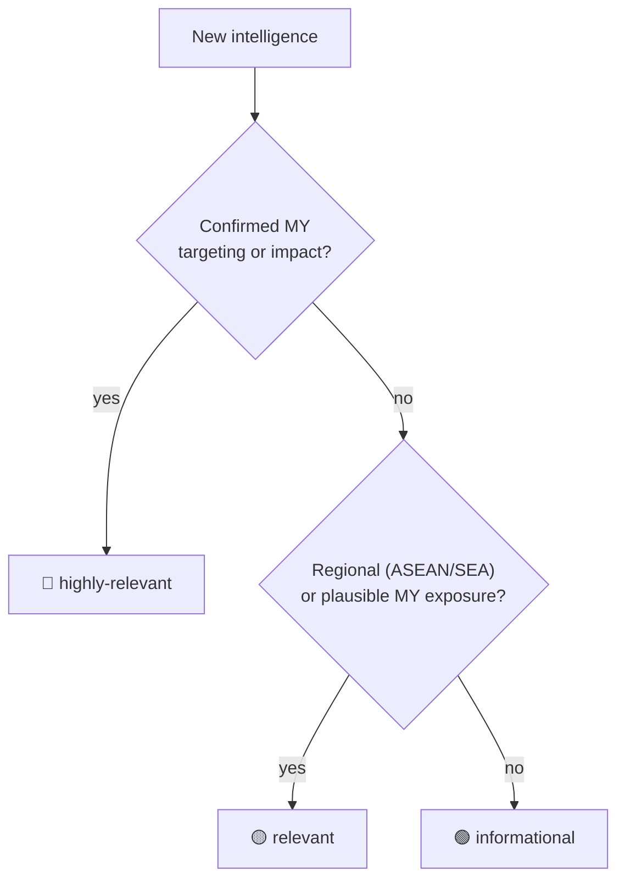

Every entry is tagged consistently so you can triage in seconds and filter with precision.

## Relevancy (the triage signal)

## Field reference

| Field | Values | Meaning |
| --- | --- | --- |
| `relevancy` | highly-relevant / relevant / informational | 🔴🟡🟢 triage above |
| `scope` | my / apac / global | Geographic scope (ICS/OT entries often global) |
| `tags` (category) | threat / defense / news | Displayed as ⚔ / 🔰 / 📰 (emoji display-only; slugs stay ASCII) |
| `tags` (target) | targeted / broad-based | Specific MY org/sector vs. global campaign with MY exposure |
| `tags` (analysis type) | campaign-analysis / malware-analysis / intrusion-analysis / infra-profile / diamond-model | What kind of work the entry contains |
| `tags` (source org) | e.g. Cisco-Talos-Intelligence-Group, Palo-Alto, Fortinet, Kaspersky, Trend-Micro, Zimperium, Huntress, SentinelOne | Originating research attribution |
| `sectors` | NCII sector names, lowercase | e.g. government, energy, telecommunications |
| `pir` | PIR-XX / GIR-X | [[intel-program/pir\|Requirement]] the entry serves |
| `tlp` | CLEAR / GREEN / AMBER / RED | Sharing constraint (published entries: CLEAR) |
| `rq_id` | RQ-YYYY-NNNN | Citable Rectifyq reference |
| `misp_uuid` | UUID | Linked MISP event |

## Attribution philosophy

TTP-first: behaviors are detectable facts; actor names are interpretations. We record vendor attributions as context, never as our own claims. For most organizations, generic detection of TTPs offers higher defensive value than definitive attribution.
